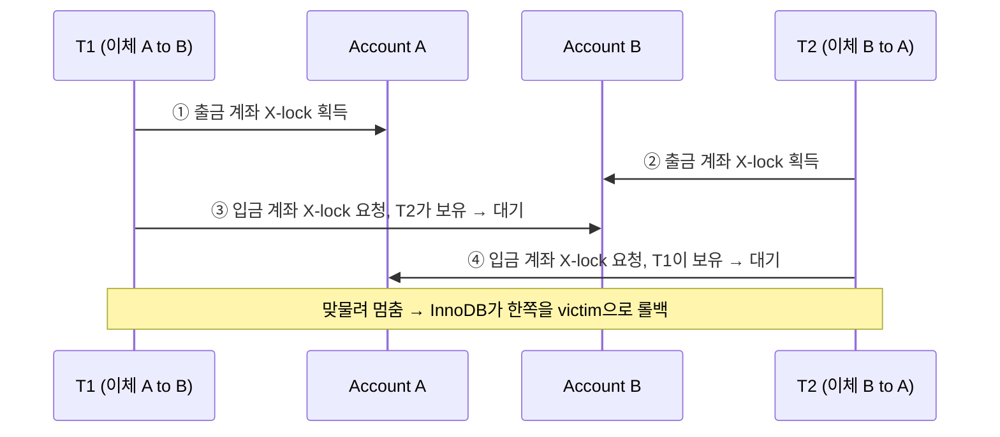
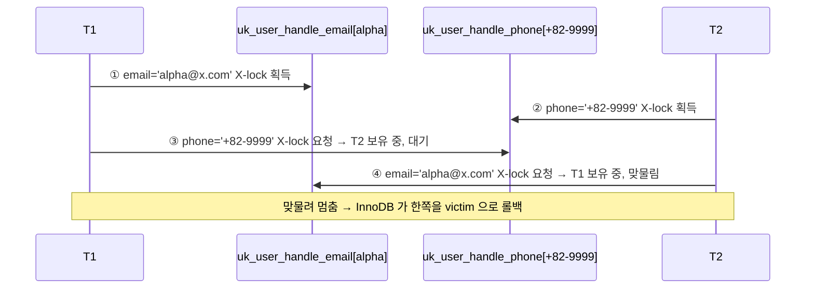
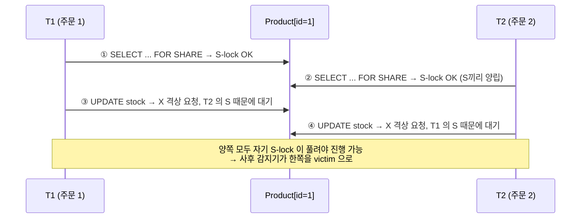
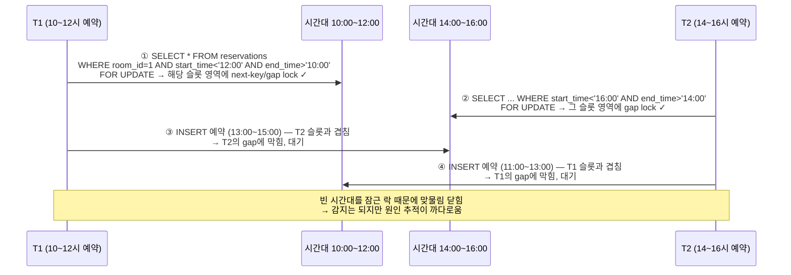

# DeadLock은 왜 항상 운영에서만 터질까

> Spring(JPA) + MySQL InnoDB 환경에서 발생하는 데드락의 3가지 패턴을 재현하고, 처방까지 검증한 단일 통합 기록.

---

# 들어가며 — DB 락과 데드락, 그리고 이 글의 목적

운영 환경에서 `ERROR 1213 Deadlock found when trying to get lock` 한 줄을 만나면 대개 두 가지 반응이 나온다. 하나는 "재현이 안 되니 일단 retry로 덮자"이고, 다른 하나는 "왜 났는지 모르겠으니 일단 같은 retry로 덮자"다. 두 반응의 공통점은 *왜 발생했는지*를 건너뛴 채 증상만 봉합한다는 점인데, 그렇게 덮어둔 데드락은 부하가 오를 때마다 같은 모양으로 다시 올라온다.

이 글은 그 회피 루프에서 벗어나는 것을 목표로 한다. 데드락을 일부러 만들어보고, InnoDB가 그 맞물려 멈춘 상태를 어떻게 끊는지 직접 관찰한 다음, 같은 패턴에 다시 빠지지 않도록 코드를 고친다. 흩어져 보이는 사례를 세 가지 패턴(A/B/C)으로 묶어, 운영 로그만 봐도 어느 카테고리인지 즉시 판단할 수 있게 하는 것이 본문 §2~§4가 향하는 지점이다.

---

## 1.1 DB 락은 왜 존재하는가

DB 락은 동시 트랜잭션이 같은 데이터를 동시에 건드릴 때 무결성을 지키기 위한 장치다. 두 트랜잭션이 아무런 통제 없이 같은 row를 읽고 쓰면 한쪽의 변경이 다른 쪽의 변경에 덮이는 Lost Update가 발생하고, 읽는 도중에 값이 바뀌는 Non-repeatable Read가 발생한다. 락은 이러한 간섭을 막기 위해 "이 데이터를 누군가 다루는 동안 다른 쪽은 기다린다"는 규칙을 강제한다.

락은 보통 두 가지 모드로 나뉜다. 공유 모드(S, Shared)는 여러 트랜잭션이 동시에 들고 읽을 수 있는 락이고, 배타 모드(X, eXclusive)는 한 트랜잭션만 들 수 있어 쓰기에 쓰인다. 두 모드의 동시 가능 여부는 단순한 행렬로 정리되는데, S와 S는 양립하지만 S와 X, X와 X는 양립하지 않는다.

규칙 자체는 단순하다. 그런데 단순한 규칙이 두 트랜잭션 사이에서 *순차적으로* 적용될 때 의외의 형태로 꼬인다.

---

## 1.2 그런데 왜 데드락이 생기는가

트랜잭션은 필요한 락을 한꺼번에 잡지 않고 SQL 한 줄씩 *순차적으로* 잡는다. 따라서 트랜잭션 T1이 자원 A의 락을 먼저 잡고 다음에 B의 락을 잡으려는 순간, 동시에 진행 중인 T2가 이미 B의 락을 들고 A의 락을 기다리고 있을 수 있다. 이때 양쪽은 서로가 들고 있는 락이 풀리길 기다리는 상태로 진입한다.

이렇게 만들어진 대기 관계가 닫힌 고리, 즉 순환 대기(맞물려 멈춤)로 이어지면 어느 쪽도 더 이상 진행할 수 없다. T1은 T2를 기다리고 T2는 T1을 기다리는 구조가 그대로 굳어버리기 때문에 timeout 없이는 영원히 끝나지 않는다. InnoDB는 이 맞물려 멈춤을 wait-for graph로 추적해 감지하고, 한쪽 트랜잭션을 강제로 victim으로 골라 롤백시킨다. 그 순간 클라이언트에 도달하는 메시지가 `ERROR 1213 Deadlock found`다.

즉 데드락은 락 자체의 결함이 아니라, 락이 *순차적으로 잡히는 자원*이라는 성질과 *두 트랜잭션의 잠금 경로가 교차하는 시나리오*가 만났을 때 자연스럽게 따라오는 결과다. 본문 §2~§4에서 다루는 세 패턴은 모두 "어떤 모양으로 그 교차가 만들어지는가"의 분류로 이어진다.

---

## 1.3 이 글에서 하려는 것

이 글의 진행은 세 단계로 짜여 있다. 먼저 각 패턴에 해당하는 데드락을 Spring + MySQL 환경에서 일부러 재현하고, 그 다음 `SHOW ENGINE INNODB STATUS`로 InnoDB가 어떻게 맞물림을 감지하고 한쪽을 끊어내는지 직접 본다. 마지막으로 같은 패턴에 다시 빠지지 않도록 코드를 고쳐, 재현 시나리오를 그대로 다시 돌렸을 때 데드락이 사라지는지 확인한다.

이 흐름을 끝까지 따라가면 운영 로그에서 막연하게 보이던 `HOLDS THE LOCK(S)` / `WAITING FOR THIS LOCK` / `lock_mode X locks gap before rec` 같은 출력이 패턴 식별 신호로 읽히기 시작한다. 본문 §5 디버깅 가이드는 이 신호들을 A/B/C 카테고리로 매핑하는 자리이므로, §1~§4가 그 매핑을 가능하게 만드는 사전 작업으로 이어진다.

본문 §2~§4는 각각 한 패턴씩 동일한 골격(데드락이 만들어지는 모양 → 언제 터지나 → 실제 코드 → 재현 → DB 처리 → 막는 법)으로 풀어가므로, 한 패턴을 끝까지 읽고 나면 나머지 두 패턴도 같은 구조로 따라 읽을 수 있다.

---

## 1.4 미리 보는 3가지 패턴

본론에 들어가기 전 큰 그림을 한 번 짚어둔다. 아래 표의 세 행이 §2, §3, §4에 1:1로 대응하며, 각 절은 같은 골격으로 자세히 풀어쓴다.

| 패턴 | 어떤 상황에서 터지나 | DB가 알아서 풀어주나 | 어떻게 막나 |
|---|---|---|---|
| **A. 잠금 순서 엇갈림**<br>(순서 비대칭) | 두 트랜잭션이 **같은 두 행을 반대 순서로** 잠근다 — T1은 [1→2], T2는 [2→1] | 즉시 감지해 한쪽을 강제 롤백 | 코드에서 **항상 같은 순서**(예: ID 오름차순)로 잠그도록 통일 |
| **B. 읽기 락 → 쓰기 락 격상 충돌**<br>(대칭 격상) | 두 트랜잭션이 **같은 한 행에** 동시에 읽기 락을 들고 있다가, 둘 다 쓰기로 바꾸려고 시도 | 감지는 되지만 **DB가 양보를 못 시킴** — 무조건 한쪽이 희생 | 읽기 락 단계를 건너뛰고 **처음부터 쓰기 락**(`PESSIMISTIC_WRITE`)으로 시작 |
| **C. 빈 범위에 동시 INSERT**<br>(Range/Gap) | 두 트랜잭션이 서로의 **"앞으로 들어올 자리"** (gap)를 잠근 상태로 그 자리에 INSERT를 시도 | 감지는 되지만 **눈에 안 보이는 락**이라 원인 추적이 어렵다 | 격리수준을 **READ COMMITTED**로 낮춰 gap lock 제거, 또는 조회 범위를 좁힘 |

세 패턴은 *충돌하는 자원의 개수와 모양*에서 갈라진다. A는 서로 다른 두 행을 반대 순서로 잡는 경우이고, B는 같은 한 행을 두 트랜잭션이 동시에 들고 있다가 둘 다 격상하는 경우이며, C는 행이 아니라 "행이 들어올 빈 자리"를 잠그는 경우다. 같은 `ERROR 1213` 한 줄로 보이지만 처방은 전혀 다르기 때문에 본문은 한 패턴씩 분리해 다룬다.

---

## 1.5 다루는 범위 / 다루지 않는 것

다루는 환경은 MySQL InnoDB와 Spring(JPA), 그리고 비관적 락 위주다. 재현 코드는 Spring Data JPA의 `@Lock` 어노테이션과 네이티브 SQL을 섞어 쓰며, DB 진단은 `SHOW ENGINE INNODB STATUS`와 `performance_schema.data_locks`를 기준으로 한다.

반대로 다음 주제는 의도적으로 범위 밖에 둔다. PostgreSQL·Oracle 같은 다른 DBMS의 락 구현, Redis나 ZooKeeper 기반 분산 락, 애플리케이션 레벨의 `synchronized`·`ReentrantLock` 류 직렬화, 그리고 낙관적 락(`@Version`) 패턴이다. 각각이 별도의 매커니즘과 트레이드오프를 가지기 때문에 한 글에 묶기보다 후속 글로 분리한다.

이 범위 안에서 §2부터 본격적으로 첫 번째 패턴인 *잠금 순서 엇갈림*을 계좌 이체 도메인으로 재현해본다.

---

# 두 트랜잭션이 같은 두 자원을 반대 순서로 잠글 때
— Asymmetric Ordering (순서 비대칭)

## 2.1 데드락이 만들어지는 모양

두 트랜잭션이 같은 행 두 개를 **반대 순서로** 잠그면, 각자 첫 번째 락은 무사히 잡고 두 번째 락에서 막힌다. 한쪽이 들고 있는 락이 풀려야 다른 쪽이 진행할 수 있는데, 그 다른 쪽도 똑같은 이유로 멈춰 있으므로 순환 대기(맞물려 멈춤)가 닫힌다.

계좌 이체로 옮기면 흐름이 그대로 따라간다. T1은 A→B 이체이므로 A를 먼저 잠그고, T2는 B→A 이체이므로 B를 먼저 잠근다. 그 다음 T1이 B를, T2가 A를 요청하는 순간 서로의 락을 기다리는 맞물려 멈춤이 만들어진다.



---

## 2.2 언제 터지나

조건은 두 가지로 단순하다. 잠가야 할 자원이 **둘 이상**이고, 락 획득이 **여러 statement로 나뉘어 순차적으로** 일어날 때다. 두 조건 중 하나라도 빠지면 맞물려 멈출 면이 없다.

계좌 이체는 출금 계좌와 입금 계좌라는 두 개의 row를 한 트랜잭션에서 차례로 잠그는 구조이므로 두 조건을 동시에 만족한다. 호출자가 임의의 순서(`fromId`, `toId`)로 인자를 넘기는 순간 락 획득 순서가 호출 패턴에 의해 결정된다.

---

## 2.3 실제 코드에서는 어떻게 나타나는가

같은 메커니즘이 코드 표면에서는 네 가지 모습으로 등장한다. 본 글은 (a)를 §2.4의 메인 도메인으로 깊게 다루고, (b)~(d)도 각각 자기 도메인으로 실측·캡처까지 풀어쓴다. 메커니즘은 모두 §2.1의 맞물려 멈춤을 따르지만 코드 표면 모양이 달라서, 운영에서 각 모양을 알아채는 감을 잡으려면 네 가지를 모두 직접 보는 편이 효율적이다.

- **(a) 멀티 로우 락 — 계좌 이체**: 한 트랜잭션 안에서 `for (item : items) findByIdForUpdate(item)` 형태로 여러 row를 차례로 잠근다. 호출자가 넘긴 ID 순서가 그대로 락 순서가 되므로, 다른 호출 시점에 ID 순서가 뒤집히면 즉시 맞물려 멈춤이 만들어진다.
- **(b) 같은 row, 다른 인덱스 경로**: 한쪽은 `findByEmail`(보조 인덱스), 다른 쪽은 `findById`(클러스터드 PK)로 같은 사용자 row에 접근한다. 두 인덱스를 거치는 락 획득 순서가 트랜잭션마다 달라지면 동일한 맞물려 멈춤이 발생한다.
- **(c) INSERT 시 여러 UNIQUE 인덱스 검사 순서**: 한 INSERT가 여러 UNIQUE 인덱스 entry에 차례로 락을 잡는데, 트랜잭션마다 검사 순서가 어긋날 때 발생한다. 회원가입 다중 UNIQUE에서 흔하다.
- **(d) 다중 테이블 접근 순서 차이**: 한쪽은 `Product → User`, 다른 쪽은 `User → Product` 순으로 잠그면 row 두 개가 아닌 테이블 두 개에서 같은 모양의 맞물려 멈춤이 만들어진다.

### 시나리오 (b) — 같은 row, 다른 인덱스 경로

**시나리오** — 두 트랜잭션이 동일한 두 사용자 row에 접근하지만 한쪽은 보조 인덱스(`email`)로, 다른 쪽은 PK(`id`)로 들어간다. 보조 인덱스 경로는 (1) 인덱스 entry에 X 락을 잡고 (2) 그 entry가 가리키는 PK row에도 X 락을 잡는 두 단계로 진행되는데, PK 경로는 단 한 단계로 PK row만 잡는다. 같은 row를 잠그는데도 락 획득 단계 수가 비대칭이기 때문에, 두 트랜잭션의 두 번째 락 시도가 엇갈리는 순간 맞물려 멈춘다.

**호출되는 메서드** — 리포지토리에는 PK 경로와 보조 인덱스 경로 두 메서드를 모두 정의한다. 보조 인덱스 경로는 JPQL에서 `m.email = :email`로 표현해, 발급되는 SQL이 `uk_member_email` 인덱스를 타게 만든다.

```java
// MemberRepository.java
@Lock(LockModeType.PESSIMISTIC_WRITE)
@Query("SELECT m FROM Member m WHERE m.id = :id")
Member findByIdForUpdate(@Param("id") Long id);

@Lock(LockModeType.PESSIMISTIC_WRITE)
@Query("SELECT m FROM Member m WHERE m.email = :email")
Member findByEmailForUpdate(@Param("email") String email);
```

서비스에는 부정 시연을 위해 한 트랜잭션 안에서 두 경로를 섞어 호출하는 메서드를 둔다.

> ⚠️ **이 코드는 부정 시연으로 구성했다.** 같은 트랜잭션 안에서 보조 인덱스 경로와 PK 경로를 섞어 잠그면, 다른 트랜잭션이 반대로 두 경로를 섞었을 때 곧장 맞물려 멈춘다. 정상 패턴은 본문 끝의 **막는 법**에서 다룬다.

```java
// MemberLockService.java
@Transactional
public void lockTwoMembers(String firstEmail, Long secondId) {
    memberRepository.findByEmailForUpdate(firstEmail); // 보조 인덱스 → PK 두 단계
    memberRepository.findByIdForUpdate(secondId);      // PK 한 단계
}
```

**재현 흐름** — `CyclicBarrier(2)`로 두 트랜잭션의 첫 번째 락 획득 단계를 정렬한 뒤 두 번째 단계로 동시에 진입시킨다. 실제로 발급된 SQL을 시간순으로 옮기면 다음과 같다.

```
-- T1 step 1: 보조 인덱스 entry('a@x.com') 락 + PK row 1 락
T1: select m1_0.id, m1_0.email, m1_0.last_login_at
    from member m1_0 where m1_0.email='a@x.com' for update of m1_0

-- T2 step 1: PK row 2 락
T2: select m1_0.id, m1_0.email, m1_0.last_login_at
    from member m1_0 where m1_0.id=2 for update of m1_0

[barrier — 두 스레드 모두 step 1 완료]

-- T1 step 2: PK row 2 요청 → T2가 보유 → 대기
T1: select m1_0.id, m1_0.email, m1_0.last_login_at
    from member m1_0 where m1_0.id=2 for update of m1_0

-- T2 step 2: 보조 인덱스 entry('a@x.com') 요청 → T1이 보유 → 맞물림
T2: select m1_0.id, m1_0.email, m1_0.last_login_at
    from member m1_0 where m1_0.email='a@x.com' for update of m1_0
```

**결과** — Hibernate가 `ERROR 1213, SQLState: 40001 — Deadlock found when trying to get lock`을 그대로 로그에 찍고, Spring이 이를 `DeadlockLoserDataAccessException`으로 변환해 호출 스레드에 던진다. 테스트는 `assertThat(failures).anyMatch(ConcurrencyTestSupport::isDeadlock)`로 양쪽 매핑을 모두 검사하므로 변환 여부와 무관하게 통과한다.

**락 상태** — `--innodb-print-all-deadlocks=ON`이 컨테이너 stdout에 찍은 LATEST DETECTED DEADLOCK 본문의 핵심 부분을 그대로 옮긴다. 두 트랜잭션이 정확히 서로의 보유 락을 기다리고 있음이 인덱스 이름과 함께 드러난다.

```
TRANSACTION 2253, ACTIVE 0 sec starting index read
LOCK WAIT 4 lock struct(s), heap size 1128, 3 row lock(s)
select m1_0.id,m1_0.email,m1_0.last_login_at from member m1_0 where m1_0.id=2 for update of m1_0
RECORD LOCKS space id 2 page no 5 n bits 72 index uk_member_email of table `lab_deadlock_b`.`member` trx id 2253 lock_mode X locks rec but not gap
 0: len 7; hex 6140782e636f6d; asc a@x.com;;
 1: len 8; hex 8000000000000001; asc         ;;

RECORD LOCKS space id 2 page no 4 n bits 72 index PRIMARY of table `lab_deadlock_b`.`member` trx id 2253 lock_mode X locks rec but not gap waiting
 0: len 8; hex 8000000000000002; asc         ;;

TRANSACTION 2251, ACTIVE 0 sec starting index read
LOCK WAIT 3 lock struct(s), heap size 1128, 2 row lock(s)
select m1_0.id,m1_0.email,m1_0.last_login_at from member m1_0 where m1_0.email='a@x.com' for update of m1_0
RECORD LOCKS space id 2 page no 4 n bits 72 index PRIMARY of table `lab_deadlock_b`.`member` trx id 2251 lock_mode X locks rec but not gap
 0: len 8; hex 8000000000000002; asc         ;;

RECORD LOCKS space id 2 page no 5 n bits 72 index uk_member_email of table `lab_deadlock_b`.`member` trx id 2251 lock_mode X locks rec but not gap waiting
 0: len 7; hex 6140782e636f6d; asc a@x.com;;
 1: len 8; hex 8000000000000001; asc         ;;
```

**해석** — 두 블록을 나란히 놓으면 cross-lock의 모양이 그대로 드러난다. `trx 2253`은 보조 인덱스 `uk_member_email` 의 'a@x.com' entry를 X 락으로 들고 있으면서 PRIMARY의 row 2를 waiting 중이고, `trx 2251`은 반대로 PRIMARY row 2를 들고 `uk_member_email`의 'a@x.com' entry를 waiting 중이다. `lock struct(s)` 수가 한쪽은 4, 한쪽은 3으로 다른데, 이는 보조 인덱스를 탄 트랜잭션이 인덱스 entry 락과 PK row 락을 둘 다 보유하기 때문이며, 같은 row에 접근하더라도 인덱스 경로에 따라 락 획득 단계가 비대칭이라는 점이 그대로 측정값으로 나타난다.

(a)와의 차이는 한 줄로 짚힌다. (a)는 같은 PK 경로를 두 트랜잭션이 반대 ID 순서로 잠그면서 맞물려 멈췄고, (b)는 같은 row에 접근하면서도 한쪽 트랜잭션이 보조 인덱스 entry 락 단계를 추가로 잡기 때문에 두 경로의 락 획득 모양이 어긋나면서 맞물려 멈춘다.

**막는 법** — 처방은 동일한 row에 접근하는 모든 경로를 PK 경로로 통일하는 것이다. 보조 인덱스 entry 락 단계가 빠지면 두 트랜잭션의 락 획득 모양이 같아지고, ID 정렬을 더하면 (a)의 처방과 같은 형태로 맞물려 멈출 면이 사라진다.

```java
// before — 안티패턴
@Transactional
public void lockTwoMembers(String firstEmail, Long secondId) {
    memberRepository.findByEmailForUpdate(firstEmail); // 보조 인덱스 → PK
    memberRepository.findByIdForUpdate(secondId);      // PK
}

// after — 처방
@Transactional
public void lockTwoMembersSafe(Long firstId, Long secondId) {
    Long lo = Math.min(firstId, secondId);
    Long hi = Math.max(firstId, secondId);
    memberRepository.findByIdForUpdate(lo); // 항상 작은 ID부터 PK 경로
    memberRepository.findByIdForUpdate(hi); // 큰 ID는 그 뒤 PK 경로
}
```

같은 동시 시나리오를 처방 코드로 `@RepeatedTest(10)` 돌리면 10회 모두 `failures`가 비어 통과한다. 보조 인덱스 조회가 비즈니스 요구상 필요하다면, 락을 잡는 단계만큼은 별도 `findByIdForUpdate` 호출로 분리해 항상 PK 경로로 통일한다.

### 시나리오 (c) — INSERT 시 여러 UNIQUE 인덱스 검사 순서

A(c) 의 본질은 한 트랜잭션이 *여러 UNIQUE 인덱스 entry* 에 차례로 락을 잡는다는 점에 있다. 두 트랜잭션이 *서로 다른 UNIQUE 인덱스* 에서 *서로 다른 기존 row* 의 entry 락을 잡는데, 그 획득 순서가 엇갈리면서 맞물려 멈춘다. 인덱스 BTree 가 둘 이상일 때 락이 잡히는 경로가 두 갈래로 갈라지므로, 한 row 가 두 보조 인덱스에서 *각각 별개의 락* 으로 보호된다는 사실이 cross-lock 의 면적을 만든다.

> 📦 **§3.4 B(b) 와의 차이** — §3.4 는 두 트랜잭션이 *같은* unique 값(예: 같은 email)으로 충돌해 *같은* 인덱스 entry 위에 묵시적 S-lock 이 공존하는 모양으로 맞물려 멈춘다. A(c) 는 락이 걸리는 인덱스 entry 가 트랜잭션마다 *다르고*, 양쪽이 *서로 다른 인덱스의 서로 다른 row* 에서 부딪힌다. 맞물려 멈추는 면적이 *한 row 위* 가 아니라 *두 row 사이* 라는 점에서 정확히 카테고리 A 의 맞물림으로 분류된다.

**도메인** — 다중 UNIQUE 키를 가진 등록

`a_user_handle` 테이블이 `email` 과 `phone` 두 UNIQUE 인덱스를 가진다. 시드로 두 row 를 미리 넣어두고, 두 트랜잭션이 *서로 다른* 인덱스 entry 에 차례로 락을 잡도록 시나리오를 짠다.

```java
// src/main/java/lab/deadlock/a/scenario_c/UserHandle.java
@Entity
@Table(
    name = "a_user_handle",
    uniqueConstraints = {
        @UniqueConstraint(name = "uk_user_handle_email", columnNames = "email"),
        @UniqueConstraint(name = "uk_user_handle_phone", columnNames = "phone"),
    }
)
public class UserHandle {
    @Id @GeneratedValue(strategy = GenerationType.IDENTITY)
    private Long id;
    @Column(nullable = false, length = 100) private String email;
    @Column(nullable = false, length = 30)  private String phone;
    // ...
}
```

리포지토리는 두 UNIQUE 인덱스 entry 에 직접 X-lock 을 잡는 보조 조회 메서드 둘을 갖는다. JPA 의 `@Lock(PESSIMISTIC_WRITE)` + `@Query` 조합으로 보조 인덱스를 거치는 `SELECT ... FOR UPDATE` 를 발급한다.

```java
@Lock(LockModeType.PESSIMISTIC_WRITE)
@Query("SELECT u FROM UserHandle u WHERE u.email = :email")
Optional<UserHandle> findByEmailForUpdate(@Param("email") String email);

@Lock(LockModeType.PESSIMISTIC_WRITE)
@Query("SELECT u FROM UserHandle u WHERE u.phone = :phone")
Optional<UserHandle> findByPhoneForUpdate(@Param("phone") String phone);
```

**호출되는 메서드** — 두 단계 락 시도

> ⚠️ **이 코드는 부정 시연으로 구성했다.** 두 UNIQUE 인덱스를 *서로 반대 방향* 으로 잠그는 트랜잭션 두 개가 동시에 들어오는 모양을 의도적으로 만든 것이다. 정상 사용법은 본 절 마지막 "막는 법" 에서 다룬다.

T1 은 `email='alpha@x.com'` entry 를 먼저 잡고 `phone='+82-9999'` entry 를 요청한다. T2 는 반대로 `phone='+82-9999'` entry 를 먼저 잡고 `email='alpha@x.com'` entry 를 요청한다. 두 entry 가 *서로 다른 보조 인덱스* 의 *서로 다른 row* 에 속하므로, §2.1 의 두-자원-반대순서 패턴이 두 인덱스 BTree 를 가로질러 그대로 만들어진다.

**재현 흐름**

시드를 두 row 로 둔다 — `SEED_A(email='alpha@x.com', phone='+82-1111')`, `SEED_G(email='gamma@x.com', phone='+82-9999')`. CyclicBarrier 로 두 트랜잭션의 단계 1 완료 시점을 맞춘 뒤 단계 2 를 동시에 진입시킨다.



실제 발급되는 SQL 두 줄을 시간순으로 그대로 적으면 메커니즘이 한눈에 들어온다.

```
T1: SELECT ... FROM a_user_handle WHERE email='alpha@x.com' FOR UPDATE  -- ① email entry X-lock
T2: SELECT ... FROM a_user_handle WHERE phone='+82-9999'    FOR UPDATE  -- ② phone entry X-lock
T1: SELECT ... FROM a_user_handle WHERE phone='+82-9999'    FOR UPDATE  -- ③ T2 보유 entry, 대기
T2: SELECT ... FROM a_user_handle WHERE email='alpha@x.com' FOR UPDATE  -- ④ T1 보유 entry, 맞물림
```

**결과** — 재현률 20/20

`@RepeatedTest(20)` 로 돌린 결과, 20 회 모두 데드락이 발생한다. CyclicBarrier 로 단계 동기화를 강제하므로 맞물려 멈춤이 거의 매번 닫힌다. `lock_wait_timeout=2` 로 줄여 두면 맞물려 멈춤이 안 닫힌 라운드에서도 빠르게 회수된다.

```
[A(c) report] deadlock hits = 20/20
```

테스트 어설션 자체는 단순하다 — 두 스레드 중 적어도 한쪽이 `DeadlockLoserDataAccessException` 또는 SQLState `40001` 로 끝나는지를 본다.

**락 상태** — 두 UNIQUE 인덱스가 맞물림의 양쪽에 등장한다

`SHOW ENGINE INNODB STATUS` 의 `LATEST DETECTED DEADLOCK` 섹션을 그대로 옮긴다. 두 인덱스 이름 `uk_user_handle_email` 과 `uk_user_handle_phone` 이 *양쪽* 의 HOLD/WAITING 줄에 모두 등장하면서, 한 트랜잭션이 한 인덱스의 entry 를 들고 다른 인덱스의 entry 를 요청하는 맞물려 멈춤이 운영 로그만으로 식별 가능하다.

```
LATEST DETECTED DEADLOCK
------------------------
2026-05-16 07:38:21 281473122098944
*** (1) TRANSACTION:
TRANSACTION 2122, ACTIVE 0 sec starting index read
mysql tables in use 1, locked 1
LOCK WAIT 4 lock struct(s), heap size 1128, 3 row lock(s)
MySQL thread id 11, OS thread handle 281473104072448, query id 96 172.17.0.1 lab statistics
select uh1_0.id,uh1_0.email,uh1_0.phone from a_user_handle uh1_0 where uh1_0.phone='+82-9999' for update of uh1_0

*** (1) HOLDS THE LOCK(S):
RECORD LOCKS space id 2 page no 7 n bits 72 index uk_user_handle_email of table `lab`.`a_user_handle` trx id 2122 lock_mode X locks rec but not gap
Record lock, heap no 2 PHYSICAL RECORD: n_fields 2; compact format; info bits 0
 0: len 11; hex 616c70686140782e636f6d; asc alpha@x.com;;
 1: len 8; hex 8000000000000001; asc         ;;

*** (1) WAITING FOR THIS LOCK TO BE GRANTED:
RECORD LOCKS space id 2 page no 8 n bits 72 index uk_user_handle_phone of table `lab`.`a_user_handle` trx id 2122 lock_mode X locks rec but not gap waiting
Record lock, heap no 3 PHYSICAL RECORD: n_fields 2; compact format; info bits 0
 0: len 8; hex 2b38322d39393939; asc +82-9999;;
 1: len 8; hex 8000000000000002; asc         ;;

*** (2) TRANSACTION:
TRANSACTION 2121, ACTIVE 0 sec starting index read
mysql tables in use 1, locked 1
LOCK WAIT 4 lock struct(s), heap size 1128, 3 row lock(s)
MySQL thread id 10, OS thread handle 281473105190656, query id 95 172.17.0.1 lab statistics
select uh1_0.id,uh1_0.email,uh1_0.phone from a_user_handle uh1_0 where uh1_0.email='alpha@x.com' for update of uh1_0

*** (2) HOLDS THE LOCK(S):
RECORD LOCKS space id 2 page no 8 n bits 72 index uk_user_handle_phone of table `lab`.`a_user_handle` trx id 2121 lock_mode X locks rec but not gap
Record lock, heap no 3 PHYSICAL RECORD: n_fields 2; compact format; info bits 0
 0: len 8; hex 2b38322d39393939; asc +82-9999;;
 1: len 8; hex 8000000000000002; asc         ;;

*** (2) WAITING FOR THIS LOCK TO BE GRANTED:
RECORD LOCKS space id 2 page no 7 n bits 72 index uk_user_handle_email of table `lab`.`a_user_handle` trx id 2121 lock_mode X locks rec but not gap waiting
Record lock, heap no 2 PHYSICAL RECORD: n_fields 2; compact format; info bits 0
 0: len 11; hex 616c70686140782e636f6d; asc alpha@x.com;;
 1: len 8; hex 8000000000000001; asc         ;;

*** WE ROLL BACK TRANSACTION (2)
```

**해석** — cross-lock 메커니즘과 운영 환경의 간헐성

두 트랜잭션의 HOLDS/WAITING 짝을 정렬하면 맞물려 멈춤이 그대로 드러난다. `trx 2122` 는 `index uk_user_handle_email` 의 `alpha@x.com` entry 를 `lock_mode X locks rec but not gap` 으로 들고, 동시에 `index uk_user_handle_phone` 의 `+82-9999` entry 를 같은 모드로 **waiting** 한다. `trx 2121` 은 반대로 `uk_user_handle_phone` 의 `+82-9999` 를 들고 `uk_user_handle_email` 의 `alpha@x.com` 을 waiting 중이다. 두 트랜잭션이 정확히 서로의 보유 락을 기다리는 모양이며, §2.1 시퀀스 다이어그램이 두 인덱스 BTree 를 가로질러 그대로 펼쳐진 형태로 이어진다.

이 모양이 *INSERT 한 줄* 만으로도 만들어지는지가 다음 질문이다. 단일 INSERT 의 unique 검사는 트랜잭션 안에서 인덱스 entry 락을 차례로 잡아 나가지만, InnoDB 가 첫 unique 충돌에서 short-circuit 하거나 검사 순서를 같은 트랜잭션 내에서 일관되게 유지하려 시도하기 때문에 cross-lock 이 *항상* 닫히지는 않는다. 본 테스트는 그 점을 명시적으로 회피해 *두 statement* 로 단계를 분리한다 — `findByEmailForUpdate` + `findByPhoneForUpdate` 를 *반대 순서* 로 호출하므로, 두 트랜잭션의 entry 락 획득 순서가 명확히 엇갈린다. INSERT 단일 호출만으로 같은 맞물려 멈추는지는 buffer pool 상태·인덱스 통계·동시성 패턴에 따라 흔들리므로 운영 환경에서는 *간헐적으로* 보이는데, 본 테스트의 두-statement 분리가 그 간헐성을 들어내 보여주는 안정 재현 경로다.

운영 로그에서 본 변종을 식별하는 단서는 두 가지로 모인다. 먼저 `index <UNIQUE_NAME>` 줄이 한 트랜잭션의 HOLDS 와 WAITING 에서 *서로 다른 이름* 으로 등장한다. 그 다음 맞물림의 양쪽이 정확히 *반대 인덱스 짝* 을 들고 기다린다. 이 둘이 동시에 보이면 맞물림 면적이 *한 row 위* 가 아니라 *두 보조 인덱스 사이* 에서 만들어졌다는 직접 증거가 된다.

**막는 법** — UNIQUE 인덱스 개수 축소 또는 충돌 키 분리

맞물려 멈출 면적은 UNIQUE 인덱스 개수에 비례한다. 인덱스가 둘 이상이고 *각각* 의 entry 가 트랜잭션마다 다른 순서로 잡힐 수 있을 때만 cross 가 닫히기 때문이다. 처방은 두 갈래로 모인다.

```java
// 처방 — retry + 의미적 에러 변환.
public void registerWithRetry(String email, String phone) {
    int attempts = 0;
    while (true) {
        attempts++;
        try {
            register(email, phone);
            return;
        } catch (DeadlockLoserDataAccessException e) {
            if (attempts >= 3) {
                throw new DuplicateHandleException("이미 사용 중인 정보입니다");
            }
        } catch (DataIntegrityViolationException e) {
            throw new DuplicateHandleException("이미 사용 중인 정보입니다");
        }
    }
}
```

첫째, UNIQUE 자체를 줄인다. 두 비즈니스 키 (email, phone) 중 하나를 별도 `phone_reservations` 테이블로 분리하면, 본 테이블에 남는 UNIQUE 가 하나로 줄어 cross 가 닫힐 두 번째 인덱스가 사라진다. 둘째, 충돌이 의미상 "이미 사용 중" 으로 흘러도 되는 경우라면 데드락과 unique violation 을 모두 `DuplicateHandleException` 한 종류로 묶어 호출자에게 같은 의미로 흘려보낸다. retry 가 *충돌 자체를 막는* 방향이 아니라 *충돌을 비즈니스 의미로 변환* 하는 방향으로 작동한다는 점에서, 처방의 무게가 메시지 변환 쪽으로 모인다.

A(c) 가 운영 환경에서 *간헐적으로* 만 보이는 이유와 처방의 방향이 자연스럽게 이어진다 — buffer pool 상태나 인덱스 통계가 바뀌면서 인덱스 검사 순서가 흔들리므로, 평소엔 잠잠하다가 트래픽 패턴이 바뀌는 순간 갑자기 맞물려 멈추는 방향으로 흘러간다. UNIQUE 인덱스 개수를 줄이는 구조 변경은 *맞물려 멈출 가능 면적 자체* 를 없애므로, 평시·피크 트래픽 모두에서 같은 안정성으로 모인다.

### 시나리오 (d) — 다중 테이블 접근 순서 차이

**시나리오** — 같은 시스템에서 두 워크플로가 `orders` 테이블과 `inventory` 테이블을 차례로 잠그는데, 한쪽은 주문 처리 흐름에서 `Order → Inventory` 순서로, 다른 쪽은 환불 처리 흐름에서 `Inventory → Order` 순서로 접근한다. 두 워크플로가 같은 `(orderId, productId)` 쌍에 동시에 들어오면 두 테이블의 row 사이에 맞물려 멈춘다.

(a)와 본질적으로 같은 cross-lock 메커니즘이지만, 자원이 *같은 테이블의 두 row*가 아니라 *서로 다른 테이블의 두 row*라는 점에서 (d)는 별도의 시나리오로 다룬다.

**호출되는 메서드** — `OrderRepository`와 `InventoryRepository`는 각각 `@Lock(PESSIMISTIC_WRITE)`로 `SELECT ... FOR UPDATE`를 발급한다. 호출자가 어느 Repository를 먼저 호출하느냐가 그대로 락 획득 순서가 된다.

```java
// src/main/java/lab/deadlock/a/scenario_d/OrderRepository.java
@Lock(LockModeType.PESSIMISTIC_WRITE)
@Query("SELECT o FROM Order o WHERE o.id = :id")
Order findByIdForUpdate(@Param("id") Long id);

// src/main/java/lab/deadlock/a/scenario_d/InventoryRepository.java
@Lock(LockModeType.PESSIMISTIC_WRITE)
@Query("SELECT i FROM Inventory i WHERE i.productId = :productId")
Inventory findByIdForUpdate(@Param("productId") Long productId);
```

> ⚠️ **이 코드는 부정 시연으로 구성했다.** 주문 모듈은 `Order → Inventory` 순서로, 환불 모듈은 `Inventory → Order` 순서로 잠근다. 도메인 흐름상 자연스러워 보이는 두 메서드가 정확히 반대 순서로 두 테이블을 건드리므로 동시에 돌면 맞물려 멈춘다. 정상 패턴은 마지막 단락의 `processOrderSafe` / `processRefundSafe`에서 다룬다.

```java
// src/main/java/lab/deadlock/a/scenario_d/OrderProcessingService.java
@Transactional
public void processOrder(Long orderId, Long productId, int quantity) {
    Order order = orderRepository.findByIdForUpdate(orderId);            // 1단계: Order 테이블
    Inventory inventory = inventoryRepository.findByIdForUpdate(productId); // 2단계: Inventory 테이블
    inventory.decrease(quantity);
    order.markPaid();
}

@Transactional
public void processRefund(Long orderId, Long productId, int quantity) {
    Inventory inventory = inventoryRepository.findByIdForUpdate(productId); // 1단계: Inventory 테이블
    Order order = orderRepository.findByIdForUpdate(orderId);            // 2단계: Order 테이블
    inventory.restore(quantity);
    order.markRefunded();
}
```

**재현 흐름** — `CyclicBarrier(2)`로 두 트랜잭션의 첫 번째 락 획득을 동기화한 뒤 두 번째 락 단계로 함께 진입시킨다. T1은 `processOrder` 흐름을 따라 `orders` row를 먼저 잠그고, T2는 `processRefund` 흐름을 따라 `inventory` row를 먼저 잠근다. barrier 통과 직후 양쪽이 두 번째 테이블의 row를 요청하면서 서로의 락을 기다리는 모양이 만들어진다.

```sql
-- T1 (주문 처리)
SELECT id, product_id, status FROM orders WHERE id = 1 FOR UPDATE;        -- step 1: 획득
-- (barrier 대기)
SELECT product_id, stock FROM inventory WHERE product_id = 10 FOR UPDATE; -- step 2: T2가 보유 → 대기

-- T2 (환불 처리)
SELECT product_id, stock FROM inventory WHERE product_id = 10 FOR UPDATE; -- step 1: 획득
-- (barrier 대기)
SELECT id, product_id, status FROM orders WHERE id = 1 FOR UPDATE;        -- step 2: T1이 보유 → 맞물림
```

**결과** — InnoDB가 맞물림을 감지해 한쪽 트랜잭션을 victim으로 골라 롤백한다. Hibernate 로그에 `ERROR 1213 Deadlock found when trying to get lock; try restarting transaction`이 찍히고, SQLState는 `40001`로 보고된다. 테스트 어설션 `assertThat(failures).anyMatch(ConcurrencyTestSupport::isDeadlock)`이 통과하므로 두 스레드 중 한 쪽이 정확히 `DeadlockLoserDataAccessException` 또는 SQLState `40001`로 끝났음이 확인된다.

```
HHH000247: ErrorCode: 1213, SQLState: 40001
Deadlock found when trying to get lock; try restarting transaction
```

**락 상태** — Testcontainers 옵션 `--innodb-print-all-deadlocks=ON` 덕에 MySQL이 컨테이너 stdout에 두 트랜잭션의 상세를 그대로 인쇄한다. 테스트는 이 출력을 `MYSQLContainer.getLogs()`로 받아 `docs/시나리오-d-관측.txt`에 저장하는데, 두 트랜잭션 블록을 나란히 놓으면 맞물려 멈춤이 그대로 드러난다.

```
TRANSACTION 2333, ACTIVE 0 sec starting index read
mysql tables in use 1, locked 1
LOCK WAIT 4 lock struct(s), heap size 1128, 2 row lock(s)
MySQL thread id 9, ... query id 348 172.17.0.1 lab statistics
select i1_0.product_id,i1_0.stock from inventory i1_0 where i1_0.product_id=10 for update of i1_0
RECORD LOCKS space id 3 page no 4 n bits 72 index PRIMARY of table `lab_deadlock_d`.`orders` trx id 2333 lock_mode X locks rec but not gap
 ...
RECORD LOCKS space id 2 page no 4 n bits 72 index PRIMARY of table `lab_deadlock_d`.`inventory` trx id 2333 lock_mode X locks rec but not gap waiting
 ...

TRANSACTION 2334, ACTIVE 0 sec starting index read
mysql tables in use 1, locked 1
LOCK WAIT 4 lock struct(s), heap size 1128, 2 row lock(s)
MySQL thread id 10, ... query id 349 172.17.0.1 lab statistics
select o1_0.id,o1_0.product_id,o1_0.status from orders o1_0 where o1_0.id=1 for update of o1_0
RECORD LOCKS space id 2 page no 4 n bits 72 index PRIMARY of table `lab_deadlock_d`.`inventory` trx id 2334 lock_mode X locks rec but not gap
 ...
RECORD LOCKS space id 3 page no 4 n bits 72 index PRIMARY of table `lab_deadlock_d`.`orders` trx id 2334 lock_mode X locks rec but not gap waiting
 ...
```

`trx 2333`(T1)은 `lab_deadlock_d.orders`의 PRIMARY 인덱스 row를 `lock_mode X locks rec but not gap`으로 들고 있고, 동시에 `lab_deadlock_d.inventory`의 PRIMARY 인덱스 row를 같은 모드로 **waiting** 중이다. 반대로 `trx 2334`(T2)는 `inventory` row를 보유한 채 `orders` row를 waiting 중이므로, 두 트랜잭션이 정확히 서로의 보유 락을 기다리는 모양이 만들어진다.

**해석** — 한 출력 안에 `lab_deadlock_d.orders`와 `lab_deadlock_d.inventory`가 모두 등장하면서 (d)의 핵심이 그대로 드러난다. 맞물려 멈춤을 닫은 자원이 *같은 테이블의 두 row*가 아니라 *서로 다른 테이블의 두 row*라는 의미인데, (a)의 출력에서는 양쪽 트랜잭션이 모두 `lab_deadlock.account` 한 테이블의 row 1·2 사이를 오갔던 반면, (d)에서는 락 정보가 두 테이블 이름 사이를 가로지른다.

메커니즘 자체는 (a)와 동일하므로 새로 배워야 할 InnoDB 동작은 없다. 다만 운영 코드 베이스에서 (d)는 (a)보다 발견이 어렵다. 주문 모듈과 환불 모듈이 서로 다른 패키지·서비스·심지어 별도 팀에 속해 있을 때, 각자는 자기 쪽 락 순서만 들여다보므로 *상대편 모듈이 어떤 순서로 같은 두 테이블을 잠그는지*를 모른 채 작성된다. 코드 리뷰에서도 `OrderProcessingService.processOrder`만 떼어 보면 자연스러운 흐름이고 `processRefund`만 떼어 봐도 자연스러운 흐름이므로, 두 메서드를 *한 화면에 같이 놓고 락 순서를 비교하기 전까지* 맞물려 멈춤이 잘 드러나지 않는다.

같은 이유로 (d)는 종종 운영 환경에 배포된 뒤 트래픽 패턴이 겹치는 시점에 처음 모습을 드러낸다. 환불 이벤트가 주문 이벤트와 동시에 들어오는 케이스가 통계적으로 드물기 때문에, 스테이징에서는 잡히지 않다가 운영에서 간헐적으로 터지는 형태로 이어진다.

**막는 법** — 처방은 (a)와 같은 원리를 *테이블 단위 컨벤션*으로 옮기는 것이다. 어느 워크플로든 항상 **같은 순서로** 두 테이블을 잠그도록 팀 내에서 약속한다. 예를 들어 "재고가 비즈니스 흐름의 보호 대상이므로 Inventory를 항상 먼저 잠근다"는 컨벤션을 두면, 주문/환불 두 메서드가 모두 같은 순서를 따르므로 맞물려 멈출 면이 사라진다.

```java
// before — 안티패턴: 두 메서드의 락 순서가 반대
@Transactional
public void processOrder(Long orderId, Long productId, int quantity) {
    Order order = orderRepository.findByIdForUpdate(orderId);
    Inventory inventory = inventoryRepository.findByIdForUpdate(productId);
    inventory.decrease(quantity);
    order.markPaid();
}

@Transactional
public void processRefund(Long orderId, Long productId, int quantity) {
    Inventory inventory = inventoryRepository.findByIdForUpdate(productId);
    Order order = orderRepository.findByIdForUpdate(orderId);
    inventory.restore(quantity);
    order.markRefunded();
}

// after — 처방: 두 메서드 모두 Inventory → Order 순서로 통일
@Transactional
public void processOrderSafe(Long orderId, Long productId, int quantity) {
    Inventory inventory = inventoryRepository.findByIdForUpdate(productId); // 항상 Inventory 먼저
    Order order = orderRepository.findByIdForUpdate(orderId);            // Order는 그 뒤
    inventory.decrease(quantity);
    order.markPaid();
}

@Transactional
public void processRefundSafe(Long orderId, Long productId, int quantity) {
    Inventory inventory = inventoryRepository.findByIdForUpdate(productId); // 같은 순서
    Order order = orderRepository.findByIdForUpdate(orderId);
    inventory.restore(quantity);
    order.markRefunded();
}
```

처방이 실제로 맞물려 멈춤을 막는지는 같은 동시 시나리오를 처방 코드로 돌려서 검증한다. `@RepeatedTest(10)`로 10회 반복했을 때 데드락이 한 번도 발생하지 않으면 통과한다.

```java
@RepeatedTest(10)
void 두_워크플로가_같은_순서로_두_테이블을_잠그면_데드락이_사라진다() throws Exception {
    var executor = Executors.newFixedThreadPool(2);
    var failures = new ConcurrentLinkedQueue<Throwable>();

    executor.submit(() -> {
        try { processingService.processOrderSafe(1L, 10L, 1); }
        catch (Throwable t) { failures.add(t); }
    });
    executor.submit(() -> {
        try { processingService.processRefundSafe(1L, 10L, 1); }
        catch (Throwable t) { failures.add(t); }
    });

    executor.shutdown();
    executor.awaitTermination(15, TimeUnit.SECONDS);

    assertThat(failures)
            .as("같은 순서 컨벤션 처방 적용 시 데드락이 발생해선 안 된다")
            .noneMatch(ConcurrencyTestSupport::isDeadlock);
}
```

10회 반복 모두 `failures`가 비어 통과한다. 안티패턴은 정확히 같은 동시 시나리오에서 맞물려 멈추게 만들었지만, 두 메서드 모두 `Inventory → Order` 순서로 통일하면 맞물려 멈출 면이 사라지므로 같은 결론으로 이어진다. (a)에서 ID 값을 기준으로 정렬했던 처방이 (d)에서는 *테이블 이름을 기준으로 한 컨벤션*으로 옮겨오는데, 단위가 row에서 table로 올라간다는 점만 다르고 원리는 동일하다.

---

## 2.4 직접 재현해보기 — 계좌 이체

### 엔티티와 비관 락 리포지토리

`Account`는 id와 잔액만 가진 단순한 엔티티로 두고, 리포지토리에는 `@Lock(PESSIMISTIC_WRITE)`를 붙인 `findByIdForUpdate`를 정의한다. 이 메서드가 발급하는 SQL이 `SELECT ... FOR UPDATE`이며, 호출되는 순서가 곧 락 획득 순서다.

```java
// src/main/java/lab/deadlock/a/account/Account.java
@Entity
@Table(name = "account")
@Getter
@NoArgsConstructor
public class Account {

    @Id
    private Long id;

    @Column(nullable = false, precision = 19, scale = 4)
    private BigDecimal balance;

    public Account(Long id, BigDecimal balance) {
        this.id = id;
        this.balance = balance;
    }

    public void withdraw(BigDecimal amount) {
        if (balance.compareTo(amount) < 0) {
            throw new IllegalStateException("insufficient balance: id=" + id);
        }
        this.balance = this.balance.subtract(amount);
    }

    public void deposit(BigDecimal amount) {
        this.balance = this.balance.add(amount);
    }
}
```

```java
// src/main/java/lab/deadlock/a/account/AccountRepository.java
public interface AccountRepository extends JpaRepository<Account, Long> {

    @Lock(LockModeType.PESSIMISTIC_WRITE)
    @Query("SELECT a FROM Account a WHERE a.id = :id")
    Account findByIdForUpdate(@Param("id") Long id);
}
```

### 안티패턴 서비스 — 호출자가 넘긴 순서 그대로 잠근다

> ⚠️ **이 코드는 부정 시연으로 구성했다.** 호출자가 넘긴 `fromId → toId` 순서대로 락을 잡으면 호출 패턴에 따라 락 순서가 결정되므로, 동시에 반대 방향 이체가 들어오면 곧장 맞물려 멈춘다. 정상 패턴은 §2.6에서 다룬다.

```java
// src/main/java/lab/deadlock/a/account/AccountTransferService.java
@Transactional
public void transfer(Long fromId, Long toId, BigDecimal amount) {
    Account from = accountRepository.findByIdForUpdate(fromId); // 1단계 락
    Account to = accountRepository.findByIdForUpdate(toId);     // 2단계 락
    from.withdraw(amount);
    to.deposit(amount);
}
```

### 재현 테스트 — CyclicBarrier로 단계 동기화

데드락은 두 트랜잭션이 첫 번째 락을 모두 잡은 뒤 두 번째 락 단계로 진입할 때 닫힌다. 두 단계 사이를 동기화하기 위해 `CyclicBarrier(2)`를 사용한다. 한 단계가 어긋나면 맞물려 멈추는 모양이 생기기 전에 한쪽이 빨리 끝나버려 재현이 흔들리므로, `concurrency-testing` 스킬의 카테고리 A 권장 패턴을 그대로 따른다.

**시나리오** — T1은 [1 → 2] 순으로, T2는 [2 → 1] 순으로 락을 시도한다. `barrier.await()`는 두 스레드가 step 1을 끝낸 시점에 모이게 만든다.

```java
// src/test/java/lab/deadlock/a/account/AccountTransferDeadlockTest.java
@Test
void 반대순서_이체_두건이_동시에_들어오면_데드락이_발생한다() throws Exception {
    var barrier = new CyclicBarrier(2);
    var executor = Executors.newFixedThreadPool(2);
    var failures = new ConcurrentLinkedQueue<Throwable>();

    executor.submit(() -> {
        try {
            transactionTemplate.executeWithoutResult(status -> {
                accountRepository.findByIdForUpdate(1L); // T1 step 1: A 락
                awaitBarrier(barrier);                   // T2 step 1 완료 대기
                accountRepository.findByIdForUpdate(2L); // T1 step 2: B 락 → 대기
            });
        } catch (Throwable t) {
            failures.add(t);
        }
    });

    executor.submit(() -> {
        try {
            transactionTemplate.executeWithoutResult(status -> {
                accountRepository.findByIdForUpdate(2L); // T2 step 1: B 락
                awaitBarrier(barrier);
                accountRepository.findByIdForUpdate(1L); // T2 step 2: A 락 → 맞물림
            });
        } catch (Throwable t) {
            failures.add(t);
        }
    });

    executor.shutdown();
    boolean finished = executor.awaitTermination(15, TimeUnit.SECONDS);
    assertThat(finished).as("두 스레드는 데드락 감지 후 정상 종료해야 한다").isTrue();

    captureInnodbStatus();

    assertThat(failures)
            .as("최소 한 스레드는 DeadlockLoserDataAccessException 또는 SQLState 40001로 실패해야 한다")
            .anyMatch(ConcurrencyTestSupport::isDeadlock);
}
```

테스트 메서드에는 `@Transactional`을 붙이지 않는다. 테스트 전체가 하나의 트랜잭션이 되면 두 스레드가 같은 컨텍스트에서 도는 효과가 나 맞물려 멈추는 모양이 생기지 않기 때문이다. 대신 `TransactionTemplate.executeWithoutResult` + `PROPAGATION_REQUIRES_NEW`로 각 스레드가 독립 트랜잭션을 갖도록 강제한다.

데드락 검증은 단순히 예외 발생 여부가 아니라 `DeadlockLoserDataAccessException` 또는 SQLState `40001`인지로 좁힌다.

```java
public static boolean isDeadlock(Throwable e) {
    while (e != null) {
        if (e instanceof DeadlockLoserDataAccessException) return true;
        if (e instanceof SQLException sql && "40001".equals(sql.getSQLState())) return true;
        e = e.getCause();
    }
    return false;
}
```

### 실행 결과 — `innodb-print-all-deadlocks=ON`이 찍어준 맞물림

Testcontainers 옵션으로 `--innodb-print-all-deadlocks=ON`을 켜두면 데드락이 감지될 때마다 MySQL이 컨테이너 stdout에 두 트랜잭션의 상세를 인쇄한다. 테스트는 이 출력을 `MYSQLContainer.getLogs()`로 받아 `관측.txt`에 저장한다.

**출력** — 실제로 캡처된 두 트랜잭션 블록은 다음과 같다.

```
TRANSACTION 2087, ACTIVE 0 sec starting index read
mysql tables in use 1, locked 1
LOCK WAIT 3 lock struct(s), heap size 1128, 2 row lock(s)
MySQL thread id 10, OS thread handle 281472566087424, query id 83 172.17.0.1 lab statistics
select a1_0.id,a1_0.balance from account a1_0 where a1_0.id=2 for update of a1_0
RECORD LOCKS space id 2 page no 4 n bits 72 index PRIMARY of table `lab_deadlock`.`account` trx id 2087 lock_mode X locks rec but not gap
Record lock, heap no 2 PHYSICAL RECORD: n_fields 4; compact format; info bits 0
 0: len 8; hex 8000000000000001; asc         ;;
 ...

RECORD LOCKS space id 2 page no 4 n bits 72 index PRIMARY of table `lab_deadlock`.`account` trx id 2087 lock_mode X locks rec but not gap waiting
Record lock, heap no 3 PHYSICAL RECORD: n_fields 4; compact format; info bits 0
 0: len 8; hex 8000000000000002; asc         ;;
 ...

TRANSACTION 2086, ACTIVE 0 sec starting index read
mysql tables in use 1, locked 1
LOCK WAIT 3 lock struct(s), heap size 1128, 2 row lock(s)
MySQL thread id 9, OS thread handle 281472567205632, query id 82 172.17.0.1 lab statistics
select a1_0.id,a1_0.balance from account a1_0 where a1_0.id=1 for update of a1_0
RECORD LOCKS space id 2 page no 4 n bits 72 index PRIMARY of table `lab_deadlock`.`account` trx id 2086 lock_mode X locks rec but not gap
Record lock, heap no 3 PHYSICAL RECORD: n_fields 4; compact format; info bits 0
 0: len 8; hex 8000000000000002; asc         ;;
 ...

RECORD LOCKS space id 2 page no 4 n bits 72 index PRIMARY of table `lab_deadlock`.`account` trx id 2086 lock_mode X locks rec but not gap waiting
Record lock, heap no 2 PHYSICAL RECORD: n_fields 4; compact format; info bits 0
 0: len 8; hex 8000000000000001; asc         ;;
 ...
```

**해석** — 두 블록을 나란히 놓으면 맞물려 멈춤이 그대로 드러난다. `trx 2087`(thread 10, T2)은 PRIMARY 인덱스의 row 1을 `lock_mode X locks rec but not gap`으로 들고 있고, 동시에 row 2를 같은 모드로 **waiting** 중이다. `trx 2086`(thread 9, T1)은 반대로 row 2를 들고 row 1을 waiting 중이다. 두 트랜잭션이 정확히 서로의 보유 락을 기다리는 모양이며, 이것이 §2.1 시퀀스 다이어그램이 말한 닫힌 맞물려 멈춤에 해당한다.

`172.17.0.1 lab statistics`로 표시된 호스트·사용자·스레드 상태에서도 두 connection이 모두 `lab` 사용자에서 들어왔음이 확인된다. `WAITING FOR THIS LOCK TO BE GRANTED` 항목이 양쪽에 모두 찍혔다는 점이 핵심이며, 이 시점에 InnoDB는 한쪽 트랜잭션을 victim으로 골라 `ERROR 1213`을 던진다.

테스트 어설션도 함께 통과한다. `assertThat(failures).anyMatch(ConcurrencyTestSupport::isDeadlock)`이 성공한다는 것은 두 스레드 중 한 쪽이 정확히 `DeadlockLoserDataAccessException` 또는 SQLState `40001`로 끝났다는 의미다.

---

## 2.5 DB는 어떻게 처리하는가

InnoDB는 맞물려 멈춤을 즉시 감지해 한쪽 트랜잭션을 강제로 롤백한다. 이때 발생하는 에러가 `ERROR 1213 Deadlock found when trying to get lock`이고, Spring은 이를 `DeadlockLoserDataAccessException`으로 변환해 호출자에게 던진다.

MySQL 8.0.29부터는 **CATS**(Contention-Aware Transaction Scheduling)가 도입되어, 락 가중치가 다른 비대칭 케이스에서는 한쪽이 양보하면서 데드락이 풀리는 경우가 생긴다. 카테고리 A는 양쪽 모두 X-lock을 격상이 아닌 **신규 획득** 요청 단계라 CATS가 가중치 비교로 풀어줄 여지가 남아 있는 유일한 패턴이다.

다만 "DB가 알아서 풀어줄지도 모른다"에 기대는 건 위험하다. 인덱스 경로가 보조 인덱스에서 클러스터드 인덱스로 갈라지거나, 쿼리가 range로 바뀌어 gap lock이 끼는 순간 보장이 즉시 깨진다. CATS는 B(대칭 격상)·C(gap 맞물림)에서는 구조상 손쓸 수 없으므로 본 패턴에서만 비교적 너그러울 뿐이다. 깊은 비교는 §3.6과 §4.5에서 다룬다.

---

## 2.6 막는 법 — 락 획득 순서를 코드에서 강제로 통일

처방은 호출자가 어떤 방향(`A→B` 또는 `B→A`)으로 이체를 요청하든 **락 순서를 한 방향으로 고정**하는 것이다. 가장 단순한 컨벤션은 ID가 작은 계좌부터 잠그도록 정렬하는 방법이다.

```java
// before — 안티패턴
@Transactional
public void transfer(Long fromId, Long toId, BigDecimal amount) {
    Account from = accountRepository.findByIdForUpdate(fromId); // 호출자 순서대로
    Account to   = accountRepository.findByIdForUpdate(toId);
    from.withdraw(amount);
    to.deposit(amount);
}

// after — 처방
@Transactional
public void transferSafe(Long fromId, Long toId, BigDecimal amount) {
    Long firstId  = Math.min(fromId, toId);
    Long secondId = Math.max(fromId, toId);

    accountRepository.findByIdForUpdate(firstId);   // 항상 작은 ID부터
    accountRepository.findByIdForUpdate(secondId);  // 큰 ID는 그 뒤

    Account from = accountRepository.findByIdForUpdate(fromId);
    Account to   = accountRepository.findByIdForUpdate(toId);
    from.withdraw(amount);
    to.deposit(amount);
}
```

같은 트랜잭션 안에서 같은 row를 다시 `FOR UPDATE`로 조회해도 이미 보유 중인 X-lock이 그대로 유지되므로 중복 비용이 사실상 없다. 호출자 쪽 순서가 `from=2, to=1`이든 `from=1, to=2`이든 락은 항상 `[1, 2]` 순서로 잡힌다.

이 처방이 실제로 맞물려 멈춤을 막는지는 **같은 동시 시나리오를 처방 코드로 돌려서** 검증한다. `@RepeatedTest(10)`로 10회 반복해도 데드락이 한 번도 발생하지 않는지 본다.

```java
@RepeatedTest(10)
void Math_minmax로_정렬한_뒤_락을잡으면_데드락이_사라진다() throws Exception {
    var executor = Executors.newFixedThreadPool(2);
    var failures = new ConcurrentLinkedQueue<Throwable>();

    executor.submit(() -> {
        try {
            transferService.transferSafe(1L, 2L, new BigDecimal("100.0000"));
        } catch (Throwable t) { failures.add(t); }
    });

    executor.submit(() -> {
        try {
            transferService.transferSafe(2L, 1L, new BigDecimal("50.0000"));
        } catch (Throwable t) { failures.add(t); }
    });

    executor.shutdown();
    executor.awaitTermination(15, TimeUnit.SECONDS);

    assertThat(failures)
            .as("정렬 처방 적용 시 데드락이 발생해선 안 된다")
            .noneMatch(ConcurrencyTestSupport::isDeadlock);
}
```

**결과** — 10회 반복 모두 `failures`가 비어 통과한다. 동일한 동시 시나리오에서 안티패턴은 맞물려 멈추게 만들지만, `Math.min/max` 정렬을 적용하면 맞물려 멈출 면이 사라진다.

다중 테이블 접근에서도 같은 원리를 컨벤션으로 옮긴다. 예를 들어 주문 처리에서 `Product`와 `User`를 모두 잠가야 한다면 항상 `Product → User` 순서로 잠그도록 팀 내에서 약속한다. "DB가 알아서 풀어주겠지"에 기대는 대신, 락 획득 순서를 코드 단에서 명시적으로 통제하는 방향으로 모인다.

마지막으로 한 가지 흔한 오해를 짚어둔다. **JDBC 배치 처리는 도움이 되는가?** 결론부터 말하면 도움이 되지 않는다. 배치라도 락은 statement 단위로 순차 획득된다. 네트워크 왕복이 줄어 락 보유 구간(window)이 짧아지므로 충돌 빈도가 약간 떨어지는 부수효과는 있으나, 맞물려 멈추게 만드는 메커니즘 자체는 동일하다. 맞물려 멈춤을 막으려면 락 순서 자체를 정렬해야 하므로, 배치는 처방이 아니라 부수효과 수준에서 끝난다.

---

# 3. 같은 행에 두 개의 공유 락이 공존한 채 양쪽이 쓰기로 격상할 때
— Symmetric Upgrade (대칭 격상)

§2 의 순서 비대칭이 *서로 다른 두 행*을 반대 순서로 잡으면서 만들어진다면, §3 은 *같은 한 행* 위에서 만들어진다. 이름 그대로 두 트랜잭션이 같은 row 에 읽기 락(S-lock)을 동시에 들고 있다가 양쪽이 모두 쓰기 락(X-lock)으로 격상을 요청하는 순간 맞물려 멈춘다. 도메인을 셋(재고 차감 / 회원가입 / 쿠폰)으로 나누면, 같은 메커니즘이 어떻게 다른 진입 경로로 표면화되는지가 그대로 드러난다.

---

## 3.1 데드락이 만들어지는 모양 (공통 골격)

S-lock 끼리는 양립한다. 두 트랜잭션이 같은 row 의 S-lock 을 동시에 잡을 수 있다는 뜻이다. 그 상태에서 양쪽이 모두 X-lock 으로 격상을 요청하면, 각자 자기 자신의 S-lock 때문에 상대의 격상 요청을 막아버린다. "내가 들고 있는 S 가 풀려야 너가 X 로 갈 수 있는데, 너의 S 가 풀려야 나도 X 로 갈 수 있다" 라는 자기참조 순환이 만들어진다.



§2 의 맞물려 멈춤이 두 행 사이를 가로지른다면, §3 의 맞물려 멈춤은 한 행 안에서 만들어진다.

---

## 3.2 언제 터지나

조건은 두 단계로 정리된다.

1. **공존 단계** — 같은 row 에 두 트랜잭션이 락을 동시에 들고 있는 구간이 먼저 만들어진다. 이 단계가 만들어지는 경로가 셋이다 — 명시적 `FOR SHARE`, INSERT 시 UNIQUE 인덱스 충돌이 만드는 묵시적 S-lock, UPSERT 검사 단계의 묵시적 S-lock.
2. **격상 단계** — 그 row 를 양쪽 모두 쓰려고 한다. UPDATE 가 dirty checking 으로 흘러나오든, INSERT 가 자기 row 를 박으려 X-lock 을 요구하든, UPSERT 의 두 번째 단계가 X 로 진행하든, 결과는 모두 "X 격상 요청"이다.

이 두 단계가 *서로 다른 트랜잭션 안에서 거의 동시에* 일어나면 §3.1 의 맞물려 멈춘다.

---

## 3.3 도메인 1: 상품 재고 차감 — `PESSIMISTIC_READ` + UPDATE 격상

**시나리오** — 인기 상품 1개에 두 명이 동시에 주문한다. 둘 다 재고를 먼저 "읽고" 그 후 차감 UPDATE 를 시도하는 흐름이다.

**호출되는 메서드** — Spring Data JPA 관용구로 `@Lock(LockModeType.PESSIMISTIC_READ)` + dirty checking 으로 UPDATE 가 자연스럽게 흘러나온다.

```java
public interface ProductRepository extends JpaRepository<Product, Long> {
    @Lock(LockModeType.PESSIMISTIC_READ)
    @Query("SELECT p FROM Product p WHERE p.id = :id")
    Optional<Product> findByIdForShare(@Param("id") Long id);
}

@Transactional
public void order(Long productId, int quantity) {
    Product p = productRepository.findByIdForShare(productId).orElseThrow();
    if (p.getStock() < quantity) throw new IllegalStateException("sold out");
    p.decreaseStock(quantity); // dirty checking → UPDATE → X 격상 요청
}
```

> ⚠️ **이 코드는 부정 시연이다.** `PESSIMISTIC_READ` 가 아니라 처음부터 `PESSIMISTIC_WRITE` 를 쓰거나 원자적 UPDATE 로 단계를 합치는 것이 정상 사용법이다. §3.7 에서 처방을 정리한다.

**결과** — CyclicBarrier 로 양쪽이 S-lock 을 잡은 시점에 동기화한 뒤 UPDATE 로 동시 진입하면, 한쪽 트랜잭션이 `ERROR 1213` (`Deadlock found when trying to get lock`) 으로 강제 롤백된다. 테스트는 `DeadlockLoserDataAccessException` 으로 검증한다.

**락 상태** — `SHOW ENGINE INNODB STATUS` 출력에서 `LATEST DETECTED DEADLOCK` 섹션을 그대로 옮긴다.

```
LATEST DETECTED DEADLOCK
------------------------
2026-05-15 19:42:08 281472473480960
*** (1) TRANSACTION:
TRANSACTION 7529, ACTIVE 0 sec starting index read
mysql tables in use 1, locked 1
LOCK WAIT 4 lock struct(s), heap size 1128, 2 row lock(s)
MySQL thread id 61497, OS thread handle 281471811899136, query id 139292 172.20.0.1 lab updating
update b_product set name='popular',stock=99 where id=9

*** (1) HOLDS THE LOCK(S):
RECORD LOCKS space id 36 page no 4 n bits 72 index PRIMARY of table `lab`.`b_product` trx id 7529 lock mode S locks rec but not gap
...

*** (1) WAITING FOR THIS LOCK TO BE GRANTED:
RECORD LOCKS space id 36 page no 4 n bits 72 index PRIMARY of table `lab`.`b_product` trx id 7529 lock_mode X locks rec but not gap waiting
...

*** (2) HOLDS THE LOCK(S):
RECORD LOCKS space id 36 page no 4 n bits 72 index PRIMARY of table `lab`.`b_product` trx id 7530 lock mode S locks rec but not gap
...

*** (2) WAITING FOR THIS LOCK TO BE GRANTED:
RECORD LOCKS space id 36 page no 4 n bits 72 index PRIMARY of table `lab`.`b_product` trx id 7530 lock_mode X locks rec but not gap waiting
...

*** WE ROLL BACK TRANSACTION (2)
```

**해석** — 두 트랜잭션이 모두 `b_product` PK 인덱스의 같은 record 에 `lock mode S locks rec but not gap` 을 보유한다. 그 위에 양쪽이 `lock_mode X locks rec but not gap waiting` 으로 격상을 요청하면서 맞물려 멈췄다. 두 record 가 같은 heap no, 같은 space/page 인 점에서 이것이 *같은 한 행*에서 만들어진 맞물림임이 그대로 보인다.

---

## 3.4 도메인 2: 회원가입 — 다중 UNIQUE 인덱스의 함정

**시나리오** — `users` 테이블에 `email`, `nickname`, `phone` 세 개의 UNIQUE 인덱스가 걸려 있다. 두 사용자가 같은 email 로 거의 동시에 가입을 시도한다. 단순한 INSERT 처럼 보이지만, InnoDB 는 UNIQUE 인덱스 충돌을 발견하면 *그 충돌 row 에 묵시적 S-lock* 을 깐다. 이 묵시적 S-lock 이 §3.1 공통 골격의 1단계가 된다.

**호출되는 메서드** — 코드만 보면 단순 INSERT 다. 묵시적 S-lock 은 코드 어디에도 드러나지 않는다.

```java
@Entity
@Table(name = "b_user", uniqueConstraints = {
    @UniqueConstraint(name = "uk_b_user_email",    columnNames = "email"),
    @UniqueConstraint(name = "uk_b_user_nickname", columnNames = "nickname"),
    @UniqueConstraint(name = "uk_b_user_phone",    columnNames = "phone"),
})
public class User { ... }

@Transactional
public void register(SignupForm form) {
    userRepository.save(new User(form.email(), form.nickname(), form.phone()));
}
```

> ⚠️ **이 코드는 부정 시연이다.** 단순 INSERT 가 데드락의 원인이라는 점이 핵심이고, 정상 사용법은 §3.7 에서 retry + 의미적 에러 변환으로 흘려보낸다.

> 📦 **§2 의 A(c) 와 혼동 주의** — §2.3 (c) 가 다룬 "한 INSERT 가 *여러* UNIQUE 인덱스를 *다른 순서*로 검사해 인덱스 entry 락 순서가 엇갈리는" 케이스는 A 패턴(순서 비대칭)이다. 본 도메인은 그게 아니라 "두 트랜잭션이 *같은* unique 값으로 충돌해 같은 row 의 S-lock 이 공존하는" B 패턴이다. 락이 걸리는 인덱스 entry 가 동일한 supremum/충돌 row 이라는 점에서 §3.1 의 공통 골격에 정확히 들어맞는다.

**결과** — 세 트랜잭션을 같은 email 로 동시에 진입시킨다. T1 이 먼저 INSERT 한 뒤 commit/rollback 을 잠시 미루는 동안 T2, T3 가 같은 email 로 INSERT 를 시도하면, T2/T3 양쪽이 동일 unique entry 에 묵시적 S-lock 을 잡는다. T1 이 rollback 된 직후 T2/T3 가 자기 row 삽입을 위한 X-lock(`insert intention`)을 요청하면서 맞물려 멈춘다. 한쪽은 `ERROR 1213` 으로, 나머지는 정상 진행 또는 unique violation 으로 마무리된다.

**락 상태** — 캡처한 `LATEST DETECTED DEADLOCK` 본문이다.

```
LATEST DETECTED DEADLOCK
------------------------
2026-05-15 19:44:02 281472473480960
*** (1) TRANSACTION:
TRANSACTION 7594, ACTIVE 0 sec inserting
mysql tables in use 1, locked 1
LOCK WAIT 4 lock struct(s), heap size 1128, 2 row lock(s), undo log entries 1
MySQL thread id 61531, OS thread handle 281472029609728, query id 139614 172.20.0.1 lab update
insert into b_user (email,nickname,phone) values ('race-59af88b8-...@test.com', ...)

*** (1) HOLDS THE LOCK(S):
RECORD LOCKS space id 37 page no 5 n bits 72 index uk_b_user_email of table `lab`.`b_user` trx id 7594 lock mode S
 0: len 8; hex 73757072656d756d; asc supremum;;

*** (1) WAITING FOR THIS LOCK TO BE GRANTED:
RECORD LOCKS space id 37 page no 5 n bits 72 index uk_b_user_email of table `lab`.`b_user` trx id 7594 lock_mode X insert intention waiting
 0: len 8; hex 73757072656d756d; asc supremum;;

*** (2) HOLDS THE LOCK(S):
RECORD LOCKS space id 37 page no 5 n bits 72 index uk_b_user_email of table `lab`.`b_user` trx id 7595 lock mode S
...

*** (2) WAITING FOR THIS LOCK TO BE GRANTED:
RECORD LOCKS space id 37 page no 5 n bits 72 index uk_b_user_email of table `lab`.`b_user` trx id 7595 lock_mode X insert intention waiting
...

*** WE ROLL BACK TRANSACTION (2)
```

**해석** — 두 트랜잭션이 모두 `index uk_b_user_email` 의 같은 `supremum` 위치에 `lock mode S` 를 잡고, `lock_mode X insert intention` 으로 격상을 시도하면서 맞물려 멈춘다. 락이 걸린 인덱스 이름이 `uk_b_user_email` 로 정확히 등장하는 점에서, 어떤 UNIQUE 인덱스에서 충돌이 일어났는지가 운영 로그만으로 식별 가능하다. UNIQUE 인덱스가 N 개일 때 어느 한 인덱스에서라도 같은 충돌 면적이 만들어지면 맞물려 멈추므로, 위험 면적은 UNIQUE 개수에 비례해 늘어난다.

---

## 3.5 도메인 3: 쿠폰 코드 동시 등록 — `INSERT ... ON DUPLICATE KEY UPDATE`

**스키마 가정** — `b_coupon_code(code VARCHAR PRIMARY KEY, claimed_by BIGINT NULL, claimed_at TIMESTAMP NULL)`. `code` 자체가 PK/UNIQUE 인 1:1 한정 발급 쿠폰이다. 같은 `code` 를 동시에 등록하려는 두 사용자가 있을 때 무슨 일이 벌어지는지를 본다.

**시나리오** — 운영자가 `WELCOME2026` 같은 코드를 풀었을 때, 두 사용자가 거의 동시에 같은 코드를 등록한다.

**호출되는 메서드** — `INSERT ... ON DUPLICATE KEY UPDATE` 한 줄이다. UPSERT 는 내부적으로 "있는지 검사 → 있으면 UPDATE / 없으면 INSERT" 두 단계로 풀린다. 검사 단계가 충돌 row 에 묵시적 S-lock 을 깔고, 그 뒤 X 격상으로 흘러간다.

```java
@Modifying
@Query(value = """
    INSERT INTO b_coupon_code(code, claimed_by, claimed_at)
    VALUES (:code, :userId, NOW())
    ON DUPLICATE KEY UPDATE claimed_by = :userId, claimed_at = NOW()
    """, nativeQuery = true)
void claim(@Param("code") String code, @Param("userId") Long userId);
```

> ⚠️ **이 코드는 부정 시연이다.** UPSERT 를 동시 트래픽에 그대로 노출하면 §3.1 의 맞물려 멈춤이 만들어진다. 정상 사용법은 §3.7 에서 명시적 `SELECT ... FOR UPDATE` 후 분기로 흘려보낸다.

**결과** — 회원가입과 동일한 3-트랜잭션 패턴으로 재현한다. T1 이 먼저 같은 code 로 UPSERT 후 잠시 보유 중 rollback, T2/T3 가 같은 code 로 UPSERT 를 시도하면 한쪽이 `ERROR 1213` 으로 죽는다.

**락 상태** — 캡처한 `LATEST DETECTED DEADLOCK` 본문이다.

```
LATEST DETECTED DEADLOCK
------------------------
2026-05-15 19:45:01 281472473480960
*** (1) TRANSACTION:
TRANSACTION 7686, ACTIVE 0 sec inserting
mysql tables in use 1, locked 1
LOCK WAIT 4 lock struct(s), heap size 1128, 2 row lock(s)
MySQL thread id 61552, OS thread handle 281472764460800, query id 139966 172.20.0.1 lab update
INSERT INTO b_coupon_code(code, claimed_by, claimed_at)
VALUES ('WELCOME-a54ac699-5fe6-4c4d-b242-88d5f3c8fd3d', 1, NOW())
ON DUPLICATE KEY UPDATE claimed_by = 1, claimed_at = NOW()

*** (1) HOLDS THE LOCK(S):
RECORD LOCKS space id 35 page no 4 n bits 72 index PRIMARY of table `lab`.`b_coupon_code` trx id 7686 lock_mode X
 0: len 8; hex 73757072656d756d; asc supremum;;

*** (1) WAITING FOR THIS LOCK TO BE GRANTED:
RECORD LOCKS space id 35 page no 4 n bits 72 index PRIMARY of table `lab`.`b_coupon_code` trx id 7686 lock_mode X insert intention waiting
 0: len 8; hex 73757072656d756d; asc supremum;;

*** (2) HOLDS THE LOCK(S):
RECORD LOCKS space id 35 page no 4 n bits 72 index PRIMARY of table `lab`.`b_coupon_code` trx id 7687 lock_mode X
...

*** (2) WAITING FOR THIS LOCK TO BE GRANTED:
RECORD LOCKS space id 35 page no 4 n bits 72 index PRIMARY of table `lab`.`b_coupon_code` trx id 7687 lock_mode X insert intention waiting
...

*** WE ROLL BACK TRANSACTION (2)
```

**해석** — `index PRIMARY of table b_coupon_code` 위에서 맞물려 멈춘다. UPSERT 가 검사 단계에서 깔아둔 락(보고는 `lock_mode X` 로 표기되지만 의미상 row 진입 차단의 *insert intention* 차원)을 양쪽이 동시에 보유하고, 동일 supremum 위치에 X-lock 으로 INSERT 진입을 시도하면서 양쪽이 막힌다. 회원가입과 다른 점은 *PK 자체에서 충돌* 한다는 점이고, 같은 점은 같은 인덱스 entry 위에서 락이 공존한 채 X 격상이 맞물려 멈추게 한다는 §3.1 의 골격이다.

---

## 3.6 DB 는 어떻게 처리하는가

§2.5 의 A 패턴에서는 CATS(Contention-Aware Transaction Scheduling)가 *한쪽만 격상*인 비대칭 케이스에서 락 가중치 비교로 맞물림을 푸는 경로가 있었다. §3 은 그게 안 통한다. 두 쪽의 가중치가 같고, 이미 부여된 S-lock 은 *회수가 불가능*한 종류의 락이기 때문이다. CATS 도 양쪽이 동시에 격상을 요청하는 맞물림은 풀어주지 못한다.

결국 사후 데드락 감지기가 한쪽 트랜잭션을 강제로 victim 으로 롤백하고 `ERROR 1213` 을 던지면서 마무리된다. §2 의 A 와의 결정적 차이는, A 는 "DB 가 풀어줄 *가능성*이 있는 패턴"이지만 B 는 "DB 가 풀어줄 수 없는 패턴"이라는 점이다.

---

## 3.7 도메인별 처방 매핑

공통 원칙은 한 줄로 줄어든다 — 같은 row 에 S-lock 두 개가 공존하는 구간을 만들지 않는다. 그 구간을 없애는 경로가 도메인별로 갈라진다.

| 도메인 | 처방 우선순위 | 핵심 |
|---|---|---|
| 재고 차감 | (1) 원자적 UPDATE → (2) `PESSIMISTIC_WRITE` | 조회 단계 자체를 없애거나 처음부터 X-lock 으로 시작 |
| 회원가입 | (1) retry + 의미적 에러 변환 → (2) 키 분리 → (3) UNIQUE 축소 | 충돌이 본래 비즈니스 의미이므로 막기보다 *변환* |
| 쿠폰 | (1) 명시적 X-lock 조회 후 분기 → (2) 카운터 row 분리 | UPSERT 의 두 단계 흐름을 명시적 한 단계로 압축 |

**도메인 1 (재고 차감)** — `PESSIMISTIC_WRITE` 를 쓰면 S 단계 자체가 사라지므로 §3.1 의 1단계가 안 만들어진다. 한 단계 더 나아가 `UPDATE b_product SET stock = stock - ? WHERE id = ? AND stock >= ?` 로 조회 단계까지 없애면, 단일 statement 가 곧 X-lock 획득 + 차감 + 무효 케이스 검사를 모두 수행한다.

```java
@Modifying
@Query(value = """
    UPDATE b_product SET stock = stock - :quantity
    WHERE id = :id AND stock >= :quantity
    """, nativeQuery = true)
int decreaseStockAtomically(@Param("id") Long id, @Param("quantity") int quantity);
```

`orderSafe` 가 이 쿼리를 그대로 호출하므로, 두 트랜잭션이 같은 productId 에 동시 진입해도 X-lock 획득은 직렬화되고 맞물려 멈출 단계 분리가 없다.

**도메인 2 (회원가입)** — 회원가입 충돌은 본래 의미상 "이미 사용 중" 에러다. 맞물려 멈추게 만들지 않는 가장 자연스러운 방향은, 데드락이든 unique violation 이든 사용자 메시지로 변환하는 retry 전략이다.

```java
public void registerSafe(SignupForm form) {
    int attempts = 0;
    while (true) {
        attempts++;
        try {
            register(form);
            return;
        } catch (DeadlockLoserDataAccessException e) {
            if (attempts >= 3) throw new DuplicateSignupException("이미 사용 중인 정보입니다");
        } catch (DataIntegrityViolationException e) {
            throw new DuplicateSignupException("이미 사용 중인 정보입니다");
        }
    }
}
```

retry 가 본질적으로 *충돌을 막는다*기보다 *충돌을 의미로 변환*한다는 점이 중요하다. retry 이후에도 같은 unique 가 살아 있으면 결국 `DuplicateSignupException` 으로 떨어지고, 사용자는 "이미 사용 중" 메시지를 받는다. 트래픽이 더 커지거나 nickname 같은 키가 자주 충돌하면, 그 키만 `nickname_reservations` 같은 별도 테이블로 분리해 INSERT 경로를 짧게 만드는 게 다음 단계다. UNIQUE 자체를 줄이는 옵션은 실무에선 마지막 선택지로 남는다.

**도메인 3 (쿠폰)** — UPSERT 의 "검사 + 격상" 두 단계를 *명시적 한 단계*로 압축한다. `SELECT ... FOR UPDATE` 로 처음부터 X-lock 을 잡고, 미할당 상태일 때만 갱신하는 흐름이다.

```java
@Lock(LockModeType.PESSIMISTIC_WRITE)
@Query("SELECT c FROM CouponCode c WHERE c.code = :code")
Optional<CouponCode> findByCodeForUpdate(@Param("code") String code);

@Transactional
public boolean claimSafe(String code, Long userId) {
    CouponCode coupon = couponRepository.findByCodeForUpdate(code)
        .orElseThrow(() -> new IllegalArgumentException("unknown code: " + code));
    if (coupon.getClaimedBy() != null) return false;
    coupon.assign(userId);
    return true;
}
```

테스트에서 두 사용자가 같은 코드로 동시에 `claimSafe` 를 호출해도 데드락은 발생하지 않고, 정확히 한 명만 `true` 를 받는다 (`successCount == 1`). 검사와 갱신이 같은 X-lock 안에서 일어나므로 §3.1 의 1단계(S-lock 공존)가 만들어질 여지가 없다. 한 단계 더 나아가, 발급 자체를 사전에 잠그는 별도 `coupon_inventory.remaining` 행을 `PESSIMISTIC_WRITE` 로 차감하는 방식은 충돌 면적을 더 줄인다.

세 도메인을 가로질러 보면, 처방은 모두 §3.1 의 "1단계 + 2단계" 분리 자체를 없애는 방향으로 모인다. 재고는 단계 자체를 한 statement 로 압축하고, 회원가입은 맞물려 멈춤을 의미적 에러로 변환하며, 쿠폰은 두 단계를 X-lock 한 단계로 합친다.

---

# 두 트랜잭션이 서로 잠근 빈 범위로 INSERT를 시도할 때
— Range/Gap Cycle (빈 범위 충돌)

회의실 예약 도메인을 예로 든다. 운영자가 특정 시간대가 비어 있는지 확인한 뒤 예약 INSERT를 넣는 흔한 흐름이 그대로 Range/Gap Cycle을 만든다. 카테고리 A·B와 가장 다른 점은 **잠금이 빈 공간에 깔린다**는 데에 있고, 그래서 운영에서 "왜 충돌이 났는지 모르겠다"는 인상이 가장 강한 패턴으로 등장한다.

---

## 4.1 데드락이 만들어지는 모양

두 트랜잭션이 각자 **서로 다른 시간 범위**에 `SELECT ... FOR UPDATE`를 걸어 gap lock(또는 next-key lock)을 보유한 채로 시작한다. gap lock은 *행*이 아니라 **앞으로 들어올 빈 자리**를 잠그는 락이므로, overlap 검사가 0건을 반환해도 그 검색이 훑은 영역에는 락이 깔린다. 회의실 예약 문맥으로 옮기면 **비어 있는 시간대 자체를 잠그는 동작**과 같다.

이 상태에서 양쪽이 **상대가 잠근 시간대를 침범하는 INSERT**를 시도하면 맞물려 멈춘다. INSERT는 insert intention lock을 요청하는데, 이 lock은 상대의 gap lock이 풀려야 진행되기 때문이다. T1은 T2의 gap에 막히고, T2는 T1의 gap에 막혀, 양쪽 모두 상대 트랜잭션의 종료를 기다린다.



---

## 4.2 언제 터지나

세 조건이 동시에 충족될 때 발생한다.

- 격리 수준이 **REPEATABLE READ**다 — InnoDB의 기본 격리이며 한국 운영 환경 대부분이 여기에 해당한다.
- 트랜잭션 안에 **범위 조회**(`start < ? AND end > ?` 같은 overlap 조건, `BETWEEN`, 보조 인덱스 range scan)가 있다.
- 그 뒤 조회가 훑은 범위와 겹치는 INSERT나 보조 인덱스 entry를 만드는 변경이 이어진다.

범위 조회 결과가 비어 있어도 조건이 깨지지 않는데, 이 부분이 §4.3 (c)와 그대로 연결된다.

---

## 4.3 실제 코드에서는 어떻게 나타나는가

### (a) 회의실 예약 — overlap 검사 후 INSERT

가장 직관적인 케이스다. "특정 시간대에 예약이 있는지 확인 → 없으면 새로 INSERT"라는 도메인 요구를 그대로 코드로 옮긴다.

```sql
SELECT id FROM reservations
WHERE room_id = ? AND start_time < ? AND end_time > ?
FOR UPDATE;
-- (결과 0건이면)
INSERT INTO reservations(room_id, start_time, end_time) VALUES (?, ?, ?);
```

이 두 줄은 운영 코드에 너무 자연스럽게 녹아 들어가서 "잠금 충돌이 날 만한 곳"이라는 인식이 생기지 않는다. 하지만 RR에서는 overlap SELECT가 인덱스 트리의 빈 영역을 통째로 잠그므로, 두 트랜잭션이 *서로 겹치지 않는* 시간대 두 곳을 동시에 검사해도 INSERT 단계에서 맞물려 멈출 수 있다.

### (b) 보조 인덱스 기반 상태 변경

조회가 아닌 *UPDATE*도 같은 함정에 빠진다. 다음 같은 쿼리는 `(room_id, status)` 보조 인덱스를 타며 자동으로 range 잠금을 잡는다.

```sql
UPDATE reservations
SET status = 'confirmed'
WHERE room_id = ? AND status = 'pending';
```

옵티마이저가 보조 인덱스를 선택하면 *조건이 매칭하는 entry들 + 그 사이의 gap*에 next-key lock이 깔린다. 이때 동시에 같은 `room_id`로 `status='pending'`인 INSERT가 들어오면 insert intention lock이 막혀 맞물림 후보가 된다.

### (c) 빈 회의실도 잠긴다

운영 미스터리의 단골이다. 예약이 *하나도 없는* 회의실에서도 overlap 조회는 인덱스 트리의 supremum pseudo-record까지 훑으면서 그 빈 구간 전체에 next-key lock을 깐다.

> ⚠️ **이 시나리오는 부정 시연이다.** `@Lock(PESSIMISTIC_WRITE)`로 overlap 검사 후 INSERT 하는 "겉보기엔 안전한" 코드가 RR에서는 *빈 회의실에서도* 데드락을 만든다는 점을 보여주려는 목적이며, 정상 사용법에서는 §4.6의 처방 중 하나를 함께 채택해야 한다.

본인이 검증한 결과 — `room_id`에 예약 row가 0건이고 두 트랜잭션이 각자 다른 시간대(10~12, 14~16)를 검사한 뒤 교차 INSERT를 시도하는 시나리오에서 데드락이 안정적으로 재현된다. `SHOW ENGINE INNODB STATUS`의 락 정보는 **supremum pseudo-record + insert intention waiting**으로 적혀 나오며, §4.4에서 그대로 확인한다. 빈 회의실에서 데드락이 나는 이유는 두 트랜잭션 모두 *같은 supremum 영역*의 next-key lock을 잡고 양쪽 INSERT가 동일 영역에 insert intention을 요청하면서 맞물려 멈추게 하기 때문이다.

---

## 4.4 직접 재현해보기

### 엔티티와 리포지토리

```java
@Entity
@Table(
    name = "reservations",
    indexes = @Index(name = "idx_reservations_room_start", columnList = "room_id, start_time")
)
public class Reservation {
    @Id @GeneratedValue(strategy = GenerationType.IDENTITY) private Long id;
    @Column(name = "room_id",    nullable = false) private Long roomId;
    @Column(name = "start_time", nullable = false) private LocalDateTime startTime;
    @Column(name = "end_time",   nullable = false) private LocalDateTime endTime;
    // 생성자 / getter 생략
}

public interface ReservationRepository extends JpaRepository<Reservation, Long> {

    @Lock(LockModeType.PESSIMISTIC_WRITE)
    @Query("""
        SELECT r FROM Reservation r
        WHERE r.roomId = :roomId
          AND r.startTime < :end
          AND r.endTime   > :start
        """)
    List<Reservation> findOverlappingForUpdate(
        @Param("roomId") Long roomId,
        @Param("start")  LocalDateTime start,
        @Param("end")    LocalDateTime end);
}
```

### 안티패턴 서비스

```java
@Service
public class ReservationService {

    @Transactional
    public Reservation reserve(Long roomId, LocalDateTime start, LocalDateTime end) {
        List<Reservation> conflicts =
            reservationRepository.findOverlappingForUpdate(roomId, start, end);
        if (!conflicts.isEmpty()) {
            throw new ReservationConflictException("...");
        }
        return reservationRepository.save(new Reservation(roomId, start, end));
    }
}
```

### 동시성 테스트 — CyclicBarrier로 맞물려 멈춤을 확정 재현

테스트는 `ReservationGapDeadlockTest` 클래스에 모았다. **두 트랜잭션을 다른 스레드에서 시작하고, 각자 overlap SELECT까지 진행한 뒤 `CyclicBarrier`로 동기화하고, 그 후 교차 INSERT를 동시에 시도**하는 패턴이며 concurrency-testing 스킬의 표준 패턴 2다.

```java
executor.submit(() -> template.executeWithoutResult(status -> {
    // step 1: T1은 10~12시 슬롯 overlap SELECT FOR UPDATE
    reservationRepository.findOverlappingForUpdate(roomId, SLOT1_START, SLOT1_END);
    awaitBarrier(barrier);
    // step 2: T2 슬롯을 침범하는 INSERT (13:00 ~ 15:00)
    reservationRepository.save(new Reservation(roomId, CROSS_FROM_T1_START, CROSS_FROM_T1_END));
    reservationRepository.flush();
}));

executor.submit(() -> template.executeWithoutResult(status -> {
    // step 1: T2는 14~16시 슬롯 overlap SELECT FOR UPDATE
    reservationRepository.findOverlappingForUpdate(roomId, SLOT2_START, SLOT2_END);
    awaitBarrier(barrier);
    // step 2: T1 슬롯을 침범하는 INSERT (11:00 ~ 13:00)
    reservationRepository.save(new Reservation(roomId, CROSS_FROM_T2_START, CROSS_FROM_T2_END));
    reservationRepository.flush();
}));
```

### 실행되는 SQL 흐름

각 트랜잭션이 RR에서 한 번 돌 때 실제로 나가는 SQL은 다음 순서다.

```sql
-- T1
SELECT id, end_time, room_id, start_time
  FROM reservations r1_0
  WHERE r1_0.room_id = 1 AND r1_0.start_time < '2026-05-16 12:00' AND r1_0.end_time > '2026-05-16 10:00'
  FOR UPDATE OF r1_0;
INSERT INTO reservations(end_time, room_id, start_time)
  VALUES ('2026-05-16 15:00', 1, '2026-05-16 13:00');

-- T2 (다른 connection)
SELECT id, end_time, room_id, start_time
  FROM reservations r1_0
  WHERE r1_0.room_id = 1 AND r1_0.start_time < '2026-05-16 16:00' AND r1_0.end_time > '2026-05-16 14:00'
  FOR UPDATE OF r1_0;
INSERT INTO reservations(end_time, room_id, start_time)
  VALUES ('2026-05-16 13:00', 1, '2026-05-16 11:00');
```

### 결과 — 데드락 발생

테스트 로그에 InnoDB가 한쪽을 강제로 끊은 흔적이 그대로 남는다.

```
HHH000247: ErrorCode: 1213, SQLState: 40001
Deadlock found when trying to get lock; try restarting transaction
```

### SHOW ENGINE INNODB STATUS — gap lock과 insert intention 표시

테스트가 데드락을 감지하면 `mysql -uroot -e "SHOW ENGINE INNODB STATUS\G"`를 컨테이너 안에서 호출해 출력을 받아 [`관측.txt`](../.claude/deadlock/blog/04-빈범위-INSERT/관측.txt)에 저장한다. 실제 캡처에서 두 트랜잭션이 어떤 락을 들고 있고 무엇을 기다리는지 그대로 보인다.

```
*** (1) TRANSACTION:
TRANSACTION 2124, ACTIVE 0 sec inserting
insert into reservations (end_time,room_id,start_time)
  values ('2026-05-16 13:00:00',1,'2026-05-16 11:00:00')

*** (1) HOLDS THE LOCK(S):
RECORD LOCKS space id 3 page no 5 n bits 72
  index idx_reservations_room_start of table `lab`.`reservations`
  trx id 2124 lock_mode X
Record lock, heap no 1 PHYSICAL RECORD: n_fields 1; compact format; info bits 0
 0: len 8; hex 73757072656d756d; asc supremum;;

*** (1) WAITING FOR THIS LOCK TO BE GRANTED:
RECORD LOCKS space id 3 page no 5 n bits 72
  index idx_reservations_room_start of table `lab`.`reservations`
  trx id 2124 lock_mode X insert intention waiting
Record lock, heap no 1 PHYSICAL RECORD: n_fields 1; compact format; info bits 0
 0: len 8; hex 73757072656d756d; asc supremum;;

*** (2) TRANSACTION:
TRANSACTION 2123, ACTIVE 0 sec inserting
insert into reservations (end_time,room_id,start_time)
  values ('2026-05-16 15:00:00',1,'2026-05-16 13:00:00')

*** (2) HOLDS THE LOCK(S):
RECORD LOCKS ... index idx_reservations_room_start ... trx id 2123 lock_mode X
 0: len 8; hex 73757072656d756d; asc supremum;;

*** (2) WAITING FOR THIS LOCK TO BE GRANTED:
RECORD LOCKS ... trx id 2123 lock_mode X insert intention waiting
 0: len 8; hex 73757072656d756d; asc supremum;;

*** WE ROLL BACK TRANSACTION (2)
```

해석하면 다음 셋이 핵심이다.

- **HOLDS THE LOCK(S)에 `lock_mode X` + supremum pseudo-record** — 두 트랜잭션 모두 인덱스 트리의 *가장 큰 영역*인 supremum 쪽 next-key lock을 보유한다. 회의실 예약이 0건이라 인덱스에는 supremum밖에 없는데도 그 위에 락이 깔려 있다.
- **WAITING FOR THIS LOCK에 `insert intention waiting`** — 두 트랜잭션이 모두 같은 supremum 영역에 새 row를 끼워 넣으려고 insert intention을 요청한다. insert intention은 상대의 gap/next-key lock이 풀려야 진행되므로 양쪽이 서로의 락을 기다리는 상태가 만들어진다.
- **`WE ROLL BACK TRANSACTION (2)`** — InnoDB가 맞물림을 감지하고 한쪽을 victim으로 골라 강제 롤백시키며 ERROR 1213을 던진다.

---

## 4.5 DB는 어떻게 처리하는가

InnoDB는 맞물림을 감지해 한쪽을 강제로 롤백시킨다. 결과만 보면 §2(순서 비대칭)나 §3(대칭 격상)과 같지만, *원인 추적*이 가장 까다로운 패턴이 여기다. 락이 걸린 대상이 **눈에 보이지 않는 빈 시간대**이기 때문이다.

- A 패턴은 "어느 row의 X-lock이 충돌했는지"가 락 정보에 적힌다.
- B 패턴도 "어느 row의 S→X 격상이 막혔는지"가 적힌다.
- C 패턴은 락 정보가 `gap` / `next-key` / `insert intention` + supremum pseudo-record로 적혀 나오므로, *어느 행 사이의 어떤 빈 공간이 잠긴 건지*가 코드와 1:1로 매핑되지 않는다.

또 MySQL 8.0.29부터 도입된 CATS(Contention-Aware Transaction Scheduling)도 이 패턴에서 도움이 안 된다. CATS는 *락 가중치*가 큰 쪽을 우선시키는 스케줄러인데, gap lock과 insert intention 사이 충돌은 우선순위로 풀리는 종류가 아니라 *대기 그래프 자체*가 맞물려 멈추게 만드는 종류이기 때문이다. §2.5에서 짚었던 "A는 CATS로 일부 풀어줄 가능성이 있다"는 기대가 C에서는 처음부터 성립하지 않는다.

---

## 4.6 막는 법

처방의 결은 셋으로 나뉜다. 각 처방의 trade-off가 다르므로 도메인 요구를 보면서 골라야 한다.

### (a) 격리 수준을 READ COMMITTED로 낮춰 gap lock 제거

가장 자주 거론되는 처방이다. RC에서는 gap lock이 사라지므로 동일 시나리오를 돌려도 데드락이 나지 않는다. 본인이 검증한 RC 테스트(`read_committed_removes_gap_lock_so_no_deadlock`)에서도 §4.4와 같은 교차 INSERT 시나리오에서 데드락이 발생하지 않았다.

```java
TransactionTemplate rc = new TransactionTemplate(txManager);
rc.setIsolationLevel(TransactionDefinition.ISOLATION_READ_COMMITTED);
```

그런데 RC는 **이중 예약 위험이 새로 생긴다**. RC에서는 두 트랜잭션이 같은 시간대로 동시에 overlap 검사를 하면 양쪽 모두 0건을 보고 *둘 다 INSERT를 통과시키므로*, "회의실 이중 예약 절대 금지" 같은 무결성 요구를 만족하지 못한다. 검증으로 만든 부정 시연 테스트(`read_committed_allows_double_booking_for_same_slot`)에서 두 트랜잭션이 동시에 같은 10~12시 슬롯으로 reserve를 호출했을 때 양쪽 모두 INSERT에 성공해 `reservations` 테이블에 같은 시간대 row가 2건 들어갔다.

> ⚠️ **부정 시연 — RC를 만능 처방으로 쓰면 안 되는 이유.** gap lock을 없애려고 격리를 낮추면 데드락은 사라지지만 이중 예약을 막을 길도 같이 사라진다. RC 환경에서 회의실 예약을 안전하게 유지하려면 *애플리케이션 레벨 직렬화*나 *UNIQUE 제약*을 함께 적용해야 한다.

결국 RR에서 gap lock으로 막던 무결성을, RC에서는 다른 수단으로 보강해야 한다는 점이 trade-off의 핵심이다.

### (b) 잠금 범위 축소 + 고정 슬롯 단위

같은 RR을 유지하면서 잠금이 *해당 회의실 안*으로만 한정되도록 보장한다. 인덱스 `(room_id, start_time)`가 잡혀 있으면 옵티마이저가 다른 회의실 영역까지는 락을 깔지 않으므로, 회의실이 많을수록 충돌 면적이 줄어든다.

한 발 더 나아가면 *시간 자체를 슬롯 단위로 끊는* 접근이 있다. 시간을 30분 같은 고정 슬롯으로 모델링하고 슬롯 row를 PK 단건 락으로 잡으면 gap lock 자체가 생기지 않는다.

```java
@Service
public class SlotBasedReservationService {

    @Transactional
    public void reserve(Long roomId, LocalDateTime start, LocalDateTime end) {
        List<Long> slotIds = slotIdsBetween(roomId, start, end);
        for (Long slotId : slotIds) {
            Optional<ReservationSlot> slot = slotRepository.findByIdForUpdate(slotId);
            if (slot.isPresent() && slot.get().isReserved()) {
                throw new ReservationConflictException("...");
            }
        }
        for (Long slotId : slotIds) {
            slotRepository.save(new ReservationSlot(slotId, roomId, true));
        }
    }
}
```

이때 슬롯 ID는 `(roomId, 시간 슬롯 번호)`로 결정되므로 *동일 회의실의 동일 슬롯*을 동시에 잠그려는 두 트랜잭션은 §2 패턴(같은 row의 X-lock 충돌)으로 단순화되고, *다른 슬롯*은 서로 영향을 주지 않는다. PK 단건 락은 gap을 만들지 않는 점이 결정적이다. 다만 슬롯을 어떻게 끊느냐(15분 vs 30분 vs 1시간)는 도메인 결정이며, 너무 잘게 끊으면 다중 슬롯 락이 §2 패턴(반대 순서 잠금)을 다시 불러올 수 있으므로 슬롯 순회 시 ID 오름차순 정렬이 함께 필요하다.

### (c) 애플리케이션 레벨 직렬화

DB 락 자체를 우회해 회의실별로 애플리케이션 큐를 두는 접근이다. 예를 들어 Redis 분산 락을 `room:{roomId}` 키로 잡고, 락 안에서만 예약 트랜잭션을 돌리면 DB에는 단일 트랜잭션만 도착한다. 본 글 범위 밖이라 자세히 풀지는 않지만, 회의실 예약처럼 **요청량이 회의실 단위로 분산되는 도메인**에서는 가장 현실적인 선택지 중 하나로 등장한다.

---

## 4.7 정리

세 카테고리 중 C는 *눈에 안 보이는 빈 공간*에 락이 깔려 있어 디버깅이 가장 까다롭다. 처방의 결도 셋으로 나뉜다 — 격리를 낮춰 gap lock을 없애되 이중 예약 위험을 다른 수단으로 막거나, 잠금 단위를 단건 락으로 바꾸거나, DB 락 자체를 우회한다. RC는 만능 처방이 아니고, 슬롯화는 도메인 모델링까지 함께 바꿔야 하므로, 어느 처방을 고르든 *데드락만 막는 게 아니라 무결성 요구를 함께 만족시키는지*를 검토해야 한다. 디버깅 가이드와 카테고리 식별은 §5로 이어진다.

---

# 디버깅 가이드 — ERROR 1213이 떴을 때 어떤 카테고리인지

§2~§4에서 세 패턴을 각각 코드와 실제 출력으로 본 뒤에는, 운영 로그에서 만나는 `ERROR 1213` 한 줄을 그 분류로 매핑하는 작업이 남는다. 이 절은 그 매핑을 위한 진단 절차를 정리한다.

---

## 5.1 에러 로그 읽는 법 — `SHOW ENGINE INNODB STATUS`의 `LATEST DETECTED DEADLOCK`

InnoDB는 가장 최근 발생한 데드락의 상세 정보를 `SHOW ENGINE INNODB STATUS`의 `LATEST DETECTED DEADLOCK` 섹션에 남긴다. MySQL 클라이언트나 운영 DB 콘솔에서 다음 한 줄로 즉시 확인된다.

```sql
SHOW ENGINE INNODB STATUS\G
```

출력의 핵심은 두 트랜잭션 각각의 상태를 나란히 보여주는 부분이다. 각 트랜잭션마다 `HOLDS THE LOCK(S)`와 `WAITING FOR THIS LOCK`이 표시되고, 마지막에 `WE ROLL BACK TRANSACTION (N)`으로 어느 쪽이 victim으로 끊겼는지 명시된다.

**lock mode 표기 해독**

| 표기 | 의미 |
|---|---|
| `lock mode S` | 공유 락 (읽기 락) — 다른 S와는 양립, X와는 충돌 |
| `lock mode X` | 배타 락 (쓰기 락) — 어떤 락과도 충돌 |
| `lock_mode X locks gap before rec` | 특정 행 *앞의 빈 공간*에 X 모드 gap lock |
| `lock_mode X locks rec but not gap` | 해당 행에만 X 락, gap에는 잡지 않음 |
| `locks gap before rec insert intention waiting` | INSERT가 gap에 막혀 대기 중 — Range/Gap 맞물림의 결정적 표지 |

같은 `X` 락이라도 `locks gap before rec`이 붙어 있는지가 A와 C를 가른다. row 자체를 잡으면 A 또는 B 계열이고, gap을 잡으면 C 계열로 흘러간다.

---

## 5.2 로그 신호로 카테고리 알아내기

세 패턴은 `LATEST DETECTED DEADLOCK` 출력에 각각 다른 모양을 남긴다. 두 트랜잭션의 `HOLDS` / `WAITING` 쌍을 비교하면 다음 세 신호 중 하나가 보인다.

**신호 — A (잠금 순서 엇갈림)**

양쪽 트랜잭션이 **서로 다른 row**를 `lock mode X`로 잡고 있고, 각자 상대의 row를 기다리는 모양이다. T1은 row 1을 들고 row 2를 기다리며, T2는 row 2를 들고 row 1을 기다린다. `gap` 표기는 없고, 두 락 모두 record lock이다. §2의 계좌 이체 재현에서 확인한 출력이 이 형태로 떨어진다.

**신호 — B (읽기 락 → 쓰기 락 격상 충돌)**

양쪽 트랜잭션이 **같은 한 row**에 `lock mode S`를 들고 있고, 각자 동일한 row를 `lock mode X`로 격상하기를 기다리는 모양이다. `HOLDS`에 S가 두 개, `WAITING`에 X가 두 개로 짝이 맞다. §3의 재고 차감·회원가입·쿠폰 재현 출력에서 이 모양을 직접 확인했다.

**신호 — C (빈 범위에 동시 INSERT)**

`WAITING FOR`에 `lock_mode X locks gap before rec` 또는 `insert intention waiting`이 등장한다. 두 트랜잭션이 들고 있는 락은 record가 아닌 gap이거나 next-key이고, 대기 중인 락도 gap 영역에 걸려 있다. §4의 회의실 예약 재현이 정확히 이 출력을 만든다.

세 신호의 결정적 차이는 *락이 row에 잡혔는가 gap에 잡혔는가*, 그리고 *양쪽이 같은 row인가 다른 row인가*다. 두 축으로 분류하면 A·B·C가 자연스럽게 갈라진다.

---

## 5.3 카테고리별 1차 대응 한 줄

카테고리가 식별되면 처방의 자리가 정해진다. §2.6 / §3.7 / §4.6에서 다룬 처방을 한 줄로 압축하면 다음과 같다.

- **A → 락 획득 순서를 코드 단에서 정렬한다** (`Math.min/max`로 ID 정렬, 테이블 접근 순서 컨벤션화)
- **B → 진입 경로에 따라 갈라진다**
  - 격상 패턴(재고 차감 류) → 처음부터 `PESSIMISTIC_WRITE`로 시작하거나 원자적 UPDATE로 조회 단계를 제거
  - INSERT 충돌(회원가입·쿠폰 류) → retry-on-deadlock + 의미적 에러 메시지로 변환, 또는 충돌 키 스키마 재검토
- **C → 격리수준을 RC로 낮추거나, 범위 조건을 좁히거나, 애플리케이션 레벨 직렬화로 우회한다**

B의 분기가 가장 자주 헷갈리는 지점이다. 같은 §3 카테고리에 속해도 재고 차감처럼 *명시적* S-lock 격상에서 터지는 경우와 회원가입처럼 *묵시적* unique 검사 S-lock 격상에서 터지는 경우는 처방이 다르다. 전자는 코드 변경이 필요하고, 후자는 retry로 봉합 후 의미적 에러로 변환하는 쪽이 더 자연스럽다.

---

## 5.4 운영에서 마주쳤을 때 30분 안에 하는 것

실제 운영에서 `ERROR 1213`을 만났을 때 우선 다섯 단계로 좁혀간다. 이 순서는 데드락 빈도가 낮을 때(시간당 한두 건)와 폭주할 때(분당 수십 건) 모두 같은 흐름으로 작동한다.

**① 로그 수집 환경부터 확인한다**

`SHOW ENGINE INNODB STATUS`는 *직전 1건만* 남기 때문에 운영에서는 누적 수집 옵션이 켜져 있어야 한다. MySQL 설정에 다음이 들어 있는지 확인한다.

```
innodb_print_all_deadlocks = ON
```

이 옵션이 켜져 있으면 모든 데드락이 MySQL 에러 로그(`/var/log/mysql/error.log` 등)에 누적되므로, 같은 시간대에 여러 건이 몰린 경우에도 패턴을 다 보존할 수 있다.

**② 카테고리를 식별한다**

§5.2의 신호 매핑을 적용해 A / B(격상) / B(INSERT 충돌) / C 중 어느 갈래에 속하는지 가른다. 같은 시간대에 두 갈래 이상이 섞여 있다면 각각 따로 보관해 분리해서 처리한다.

**③ retry로 봉합 가능한지 판단한다**

A와 B(INSERT 충돌)는 retry로 우선 봉합이 가능하다. 데드락 victim 쪽 트랜잭션을 짧은 백오프로 재시도하면 두 번째 시도에서 대부분 통과한다. 반대로 B(격상 충돌)와 C는 retry해도 동일한 락 모양이 재현되므로, 부하만 늘면서 같은 데드락이 또 터진다. 이 경우는 핫픽스가 아니라 코드 변경 일정으로 옮긴다.

**④ 빈도를 측정한다**

데드락 카운트를 APM 또는 메트릭 시스템(Prometheus, Datadog 등)에서 알람으로 걸어둔다. MySQL의 `information_schema.INNODB_METRICS`에서 `lock_deadlocks` 메트릭으로 누적 카운트를 뽑을 수 있다.

```sql
SELECT NAME, COUNT FROM information_schema.INNODB_METRICS WHERE NAME = 'lock_deadlocks';
```

빈도 추이를 확인해두면 운영에서만 터지는 이유가 *부하·동시성*에서 비롯됨이 드러나고, 부하 테스트 환경에서 재현해야 할 동시 트랜잭션 수가 산정된다.

**⑤ 재현 환경에서 검증 후 배포한다**

데드락은 운영 동시성에서 비로소 모양을 드러내므로, 스테이징에서 JMeter나 k6 같은 부하 도구로 재현해 패치 효과를 검증한 뒤 배포한다. §2~§4에서 사용한 Testcontainers 기반 단위 테스트는 패턴 자체를 잡아내지만, 운영 부하 수준의 재현은 부하 테스트 단계에서 한 번 더 통과시키는 편이 안전하다.

이 다섯 단계로 운영의 첫 30분이 채워지고, 그 다음부터는 카테고리에 맞는 §2~§4의 처방을 코드 변경 일정에 따라 적용해간다.

---

# 정리

데드락은 운이 아니라 패턴이다. 같은 두 행을 반대 순서로 잠그는 흐름, 같은 한 행에 공유 락을 함께 들고 양쪽이 쓰기로 격상하는 흐름, 빈 범위를 서로 잠근 채 그 안으로 INSERT를 던지는 흐름으로 갈라진다. §2~§4에서 살펴본 A·B·C 세 패턴은 각각 만들어지는 메커니즘이 다르고, 그에 따라 처방의 자리도 달라진다.

---

## 세 패턴을 한눈에 다시 본다

본문에서 다뤘던 세 패턴을 §1.4 표 그대로 다시 가져온다. 글을 닫기 전에 한 번 더 같은 격자에 놓고 보면, 에러 로그를 다시 만났을 때 어디부터 짚어야 할지가 자연스럽게 따라온다.

| 패턴 | 어떤 상황에서 터지나 | DB가 알아서 풀어주나 | 어떻게 막나 |
|---|---|---|---|
| **A. 잠금 순서 엇갈림**<br>(순서 비대칭) | 두 트랜잭션이 **같은 두 행을 반대 순서로** 잠근다 — T1은 [1→2], T2는 [2→1] | 즉시 감지해 한쪽을 강제 롤백 | 코드에서 **항상 같은 순서**(예: ID 오름차순)로 잠그도록 통일 |
| **B. 읽기 락 → 쓰기 락 격상 충돌**<br>(대칭 격상) | 두 트랜잭션이 **같은 한 행에** 동시에 읽기 락을 들고 있다가, 둘 다 쓰기로 바꾸려고 시도 | 감지는 되지만 **DB가 양보를 못 시킴** — 무조건 한쪽이 희생 | 읽기 락 단계를 건너뛰고 **처음부터 쓰기 락**(`PESSIMISTIC_WRITE`)으로 시작 |
| **C. 빈 범위에 동시 INSERT**<br>(Range/Gap) | 두 트랜잭션이 서로의 **"앞으로 들어올 자리"** (gap)를 잠근 상태로 그 자리에 INSERT를 시도 | 감지는 되지만 **눈에 안 보이는 락**이라 원인 추적이 어렵다 | 격리수준을 **READ COMMITTED**로 낮춰 gap lock 제거, 또는 조회 범위를 좁힘 |

---

## 공통 메타 교훈 — 락 *X*를 통제한다

세 패턴의 처방을 나란히 놓으면, 모두 **락 획득을 코드 단에서 명시적으로 통제한다**는 한 가지 원리에 모인다. 통제 대상이 달라질 뿐, DB의 자동 처리를 믿고 맡기는 자리에서는 데드락이 다시 만들어진다.

- **A는 락 *순서*를 통제한다** — ID 오름차순 같은 컨벤션으로 두 트랜잭션이 같은 순서로 자원을 잡도록 강제한다.
- **B는 락 *모드와 단계*를 통제한다** — 읽기 락 단계를 건너뛰고 처음부터 X-lock으로 시작하거나, INSERT 충돌 경로 자체를 짧게 만든다.
- **C는 락이 걸리는 *범위*를 통제한다** — 인덱스로 범위를 좁히고, 격리수준을 조정하고, 시간대 같은 연속 자원을 고정 단위로 슬롯화한다.

처방의 모양은 도메인마다 다르지만, 결국 "DB가 어떤 락을 어디에 잡는지"를 코드가 직접 결정하도록 끌어오는 방향으로 모인다.

---

## DB가 알아서 풀어줄 것이라는 기대를 버린다

MySQL 8.0.29부터 들어온 CATS는 데드락 가중치를 비교해 한쪽을 양보시키지만, 모든 패턴에서 작동하지는 않는다. A의 일부 — 양쪽 격상이 아닌 비대칭 케이스 — 만 풀어주고, B처럼 양쪽 모두 같은 가중치로 격상을 요청하는 구조나 C처럼 gap에 걸린 락 충돌에서는 손쓸 수 없다.

게다가 CATS가 풀어줄 *가능성*이 있는 A에서도, 인덱스 경로나 쿼리 형태가 달라지면 그 보장은 쉽게 깨진다. 운영에서 데드락을 줄이려면 "DB가 어떻게든 해주겠지"라는 자리에서 한 발 물러나, 락이 잡히는 모양을 코드 쪽에서 먼저 정리해 두는 편이 안전하다.

---

## 재시도로 덮을 수 있는 패턴과 그렇지 않은 패턴

데드락 대응 전략은 *재시도해서 풀리는지*를 기준으로 두 갈래로 나뉜다. 운영에서 `ERROR 1213`을 만났을 때 가장 먼저 판단해야 하는 지점이기도 하다.

- **재시도 가능한 패턴 (의미적 충돌)** — 회원가입 unique violation처럼 충돌 자체가 "이미 사용 중"이라는 비즈니스 메시지로 변환되는 경우다. retry-on-deadlock에 사용자 메시지를 얹어 임시 봉합이 가능하다.
- **재시도해도 또 터지는 패턴 (구조적 맞물림)** — B의 격상 충돌과 C의 gap 맞물림처럼 락 모양 자체가 데드락을 만들어내는 경우다. 코드 경로나 스키마를 바꾸지 않으면 같은 동시성에서 동일하게 재발한다.

같은 `ERROR 1213`이라도 어느 갈래에 속하는지에 따라 우선순위가 달라진다. retry로 덮을 수 있다면 그 자리에서 봉합한 뒤 나중에 보고, 구조적 맞물림이라면 그날의 핫픽스가 아니라 코드 변경 일정으로 옮긴다.

---

## 다음 글로 이어지는 떡밥

이 글은 비관적 락 중심으로 데드락의 세 패턴을 정리하는 데에서 멈췄다. 같은 동시성 문제를 다른 각도에서 다루는 주제들은 다음 글에서 이어 다룬다.

- **낙관적 락** — 락을 잡지 않고 버전 비교로 충돌을 감지하는 방식.
- **MVCC와 일관된 읽기** — InnoDB가 락 없이도 같은 트랜잭션 안에서 일관된 스냅샷을 보여주는 메커니즘.
- **`innodb_lock_wait_timeout` 튜닝** — 데드락이 아닌 단순 락 대기를 어디서 끊을지 결정하는 파라미터.
- **분산 락 (Redis, ZooKeeper)** — DB 락을 우회해 애플리케이션 레벨에서 직렬화를 만드는 도구들.

---

# 참고

본 글에서 사용한 메커니즘과 검증 자료의 출처다.

---

## MySQL 공식 문서

- [InnoDB Locking](https://dev.mysql.com/doc/refman/8.0/en/innodb-locking.html) — InnoDB가 잡는 락 종류(Record, Gap, Next-key, Insert Intention, Auto-inc)와 호환 매트릭스. §2.1·§4.1의 락 모드 표기 해독은 이 문서가 기준.
- [InnoDB Deadlock Detection](https://dev.mysql.com/doc/refman/8.0/en/innodb-deadlocks.html) — 데드락 감지 메커니즘(wait-for graph)과 `SHOW ENGINE INNODB STATUS`의 `LATEST DETECTED DEADLOCK` 섹션 구조. §5.1·§5.2의 로그 신호 매핑 근거.
- [InnoDB Transaction Isolation Levels](https://dev.mysql.com/doc/refman/8.0/en/innodb-transaction-isolation-levels.html) — REPEATABLE READ vs READ COMMITTED에서 gap lock 동작 차이. §4.6 (a) RC trade-off 분석의 근거.

---

## MySQL 릴리즈 노트

- [MySQL 8.0.29 Release Notes — Lock scheduler (CATS)](https://dev.mysql.com/doc/relnotes/mysql/8.0/en/news-8-0-29.html) — Contention-Aware Transaction Scheduling 도입. §2.5에서 다룬 "A는 CATS가 풀어줄 가능성이 있는 유일한 패턴"이라는 결론이 여기서 출발한다.

---

## 재현 코드

본 글의 모든 재현 코드는 lab 프로젝트의 다음 패키지에 들어 있다.

- `lab.deadlock.a.account` — §2 계좌 이체 (Asymmetric Ordering)
- `lab.deadlock.b.product` / `lab.deadlock.b.signup` / `lab.deadlock.b.coupon` — §3 재고 차감 / 회원가입 / 쿠폰 (Symmetric Upgrade)
- `lab.deadlock.c.reservation` — §4 회의실 예약 (Range/Gap Cycle)

각 패키지의 `src/test/java/...` 아래에 동시성 재현 테스트가 들어 있으며, Testcontainers MySQL 위에서 그대로 실행된다.

---

